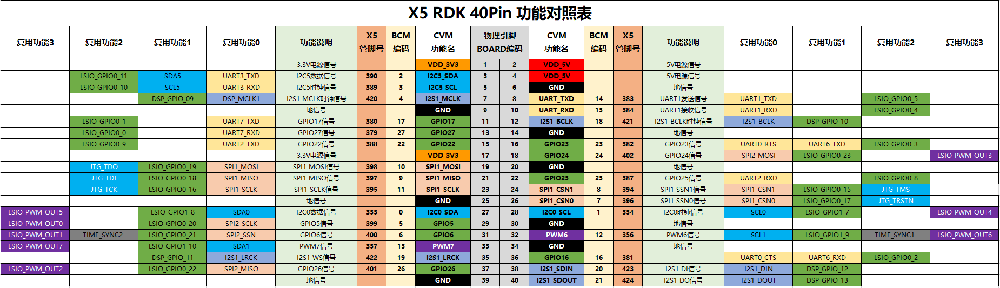

# 第 12 课：RDK X5 40pin UART 串口通信

> **课程定位：** 认识 RDK X5 40pin 上的 UART1，掌握串口接线、通信参数和 Python API，并完成 UART 回环收发实验。
>
> **适用硬件：** RDK X5
>
> **配套代码：** [`code/uart_loopback.py`](./code/uart_loopback.py)
>
> **飞书讲义：** [第 12 课　40pin 使用（2）UART 串口通信](https://horizonrobotics.feishu.cn/docx/Qjdhd8j7yoxWlSxsGJec4DojnGc)

---

## 1. 学习目标

完成本课后，你将能够：

1. 说明 UART 中 TX、RX 和 GND 的作用
2. 找到 RDK X5 UART1 对应的 BOARD 物理引脚
3. 说明波特率和 8N1 的含义
4. 运行系统预置示例，完成串口回环测试
5. 使用 Python `serial` API 发送和接收数据

---

## 2. 准备材料

| 物品 | 数量 | 说明 |
|------|------|------|
| RDK X5 | 1 | 使用 40pin 排针上的 UART1 |
| 杜邦线 | 1 | 连接 TXD 与 RXD，完成回环测试 |
| 3.3V TTL 串口外设 | 选配 | GPS、串口传感器或 USB 转 TTL 模块 |

> **接线前请断电。** RDK X5 UART1 使用 3.3V TTL 电平。不要把 RS-232 接口或 5V 串口信号直接接入 40pin，否则可能损坏开发板。

---

## 3. UART 串口基础

UART（Universal Asynchronous Receiver/Transmitter，通用异步收发器）通过串行方式传输数据。发送端使用 TX 输出数据，接收端使用 RX 接收数据。

UART 没有共享时钟线，因此通信两端必须使用相同的参数：

| 参数 | 本课设置 | 说明 |
|------|----------|------|
| 波特率 | 115200 | 每秒传输的符号数量 |
| 数据位 | 8 | 每帧包含 8 位有效数据 |
| 校验 | None | 不使用奇偶校验 |
| 停止位 | 1 | 每帧使用 1 个停止位 |
| 流控 | None | 本实验不使用 RTS 和 CTS |

上面的配置通常写成 **115200 8N1，无流控**。两端只要有一项参数不同，就可能出现乱码或收不到数据。

连接两个设备时，发送线和接收线需要交叉连接：

```text
RDK TX  ───────── 外设 RX
RDK RX  ───────── 外设 TX
RDK GND ───────── 外设 GND
```

TX 和 RX 交叉后，RDK 发送的数据才能进入外设接收端。两端还必须共地，否则电平没有共同参考，通信可能失败或不稳定。

---

## 4. RDK X5 UART1 引脚

RDK X5 默认在 40pin 接口上启用 UART1，使用 BOARD Pin 8 和 Pin 10，IO 电平为 3.3V。



本课使用下面三个引脚：

| BOARD 引脚 | 信号 | 本课用途 |
|-----------|------|----------|
| **Pin 8** | UART1_TXD | RDK 发送数据 |
| **Pin 10** | UART1_RXD | RDK 接收数据 |
| **Pin 6** | GND | 连接外设公共地 |

本课使用 BOARD 物理编号。Pin 8 就是排针上的物理 8 号脚，不要把它误认为 BCM、CVM 或 SoC 编号。

---

## 5. 查看串口设备与配置

### 5.1 查看设备节点

```bash
ls -l /dev/ttyS*
```

RDK X5 的 40pin UART1 通常对应：

```text
/dev/ttyS1
```

`/dev/ttyS0` 是系统调试串口。除非已经清楚它的启动日志和控制台用途，否则不要把它用于本课实验。

### 5.2 检查复用配置

UART1 默认启用。如果 Pin 8 和 Pin 10 没有串口功能，可以打开配置工具检查接口状态：

```bash
sudo srpi-config
```

1. 选择 **3 Interface Options**
2. 进入 **I3 Peripheral bus config**
3. 确认对应串口功能显示为 `okay`
4. 保存配置并重启开发板

`okay` 表示启用专用接口，`disabled` 表示关闭。修改复用配置后必须重启才能生效。

### 5.3 检查 Python 库

```bash
python3 -c "import serial; print(serial.VERSION)"
```

如果出现 `ModuleNotFoundError`，安装 pyserial：

```bash
python3 -m pip install pyserial
```

---

## 6. 实验一：运行系统回环示例

回环测试让 UART1 自己发送、自己接收。开发板断电后，用一根杜邦线连接：

| 一端 | 另一端 | 作用 |
|------|--------|------|
| BOARD Pin 8（UART1_TXD） | BOARD Pin 10（UART1_RXD） | 把发送数据送回接收端 |

回环实验不需要连接 3.3V 或 5V 引脚。

上电启动后，运行系统预置示例：

```bash
python3 /app/40pin_samples/test_serial.py
```

程序询问设备名时输入 `/dev/ttyS1`，询问波特率时输入 `115200`。接线和设备选择正确时，终端会连续显示：

```text
Starting demo now! Press CTRL+C to exit
Send: AA55
Recv: AA55
```

发送和接收内容一致，说明 UART1 的发送、接收和当前参数都能正常工作。按 `Ctrl+C` 结束程序。

---

## 7. 实验二：运行课程 Demo

本课程提供一个固定设备和波特率的 Python 程序，不需要传入命令行参数。

```bash
git clone https://github.com/D-Robotics/rdk-course-demos.git
cd rdk-course-demos/01_beginner/12_40pin_uart_i2c/code
python3 uart_loopback.py
```

程序每秒发送一次 `AA55`，再读取 4 个字节：

```text
发送 AA55
接收 AA55
```

按 `Ctrl+C` 退出，程序会关闭串口设备。

---

## 8. Python `serial` API

课程 Demo 使用下面几个 API：

| API | 作用 |
|-----|------|
| `serial.Serial("/dev/ttyS1", 115200, timeout=1)` | 打开 UART1，设置波特率和超时 |
| `ser.write(data)` | 发送 bytes 类型的数据 |
| `ser.read(size)` | 读取指定数量的字节 |
| `ser.readline()` | 读取一行数据，通常以换行符结束 |
| `ser.close()` | 关闭串口并释放设备 |

`write()` 接收的是 bytes。字符串发送前需要使用 `encode()`，收到 bytes 后可以使用 `decode()` 转回字符串。

```python
text = "hello RDK"
ser.write(text.encode())

data = ser.readline()
print(data.decode())
```

---

## 9. 连接真实串口模块

回环测试通过后，可以连接 GPS、串口传感器或 USB 转 TTL 模块。

| RDK X5 | 串口外设 |
|--------|----------|
| BOARD Pin 8（UART1_TXD） | RX |
| BOARD Pin 10（UART1_RXD） | TX |
| BOARD Pin 6（GND） | GND |

外设是否由开发板供电，要根据外设手册单独确认。只做通信测试时，优先让外设使用自己的合规电源，两端保持共地。

---

## 10. 常见问题

| 现象 | 可能原因 | 处理方法 |
|------|----------|----------|
| 找不到 `/dev/ttyS1` | UART 功能未启用或系统配置异常 | 使用 `srpi-config` 检查串口并重启 |
| 打开串口时 `Permission denied` | 当前用户没有设备权限 | 检查设备权限，必要时使用 `sudo python3` |
| 发送后没有接收 | Pin 8 与 Pin 10 未连通，或真实外设 TX/RX 未交叉 | 断电后重新核对接线 |
| 收到乱码 | 波特率、数据位、校验或停止位不一致 | 让两端使用相同参数 |
| 数据不稳定 | 没有共地、电平不兼容或线材接触不良 | 检查 GND、3.3V TTL 电平和线材 |
| 数据不完整 | 读取长度、结束符或超时设置不合适 | 检查 `read()` 长度和 `timeout` |

---

## 11. 本课小结

- RDK X5 默认在 BOARD Pin 8 和 Pin 10 上启用 UART1
- UART1 使用 3.3V TTL 电平，真实外设需要 TX/RX 交叉并共地
- 本课统一使用 115200、8N1 和无流控
- 40pin UART1 通常对应 `/dev/ttyS1`，不要误用系统调试串口 `/dev/ttyS0`
- 先完成 TXD 与 RXD 回环测试，再连接真实串口外设
- Python 通过 `serial.Serial()`、`write()`、`read()` 和 `close()` 完成串口收发

## 参考资料

- [RDK 官方文档：UART 使用说明](https://d-robotics.github.io/rdk_doc/en/Basic_Application/01_40pin_user_sample/uart/)
- [RDK X5 40pin GPIO 定义](https://developer.d-robotics.cc/rdk_doc/en/Basic_Application/01_40pin_user_sample/40pin_define/)
