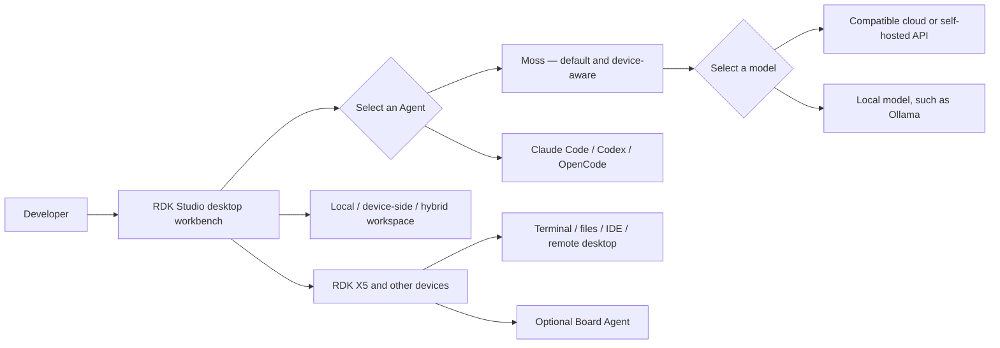

# RDK Lesson 03: Getting Started with RDK Studio

> Course version: This course is based on RDK Studio v1.3.3. For later interface or feature changes, follow the corresponding later release.
>
> Demo device: RDK X5 8GB connected over SSH
>
> Course goal: Understand how RDK Studio, Moss, models, external Agents, and Board Agents relate to each other, complete a read-only X5 health check, and use one prompt to launch real-time USB-camera YOLO detection on the X5 BPU.
>
> Recommended study time: approximately 18 minutes
>
> Learning format: concept explanation + hands-on RDK Studio operation

---

## Companion resources

| Resource | URL | Purpose |
|---|---|---|
| RDK Studio product page | https://developer.d-robotics.cc/rdkstudio | Download the application and find product information |
| RDK Documentation Center | https://d-robotics.github.io/rdk_doc_center/en/ | Find official RDK Studio and board documentation |
| RDK Course Demos (English) | https://d-robotics.github.io/rdk-course-demos/ | Read the English handbook and course demos |
| RDK 课程 Demo（中文） | https://d-robotics.github.io/rdk-course-demos/zh/ | 阅读中文讲义和课程 Demo |
| D-Robotics on GitHub | https://github.com/D-Robotics | Find examples, TROS, ModelZoo, and documentation source |

The source Markdown handbook and source HTML presentation for this lesson will also live in the GitHub `rdk-course-demos` repository. GitHub Pages is the published reading interface; the Markdown and HTML files in the repository are the maintainable source content.

---

## 1. What problem does this lesson solve?

Once an RDK board is connected, development work can quickly spread across many windows: a terminal for system status, a file tool for logs, an IDE for code, a browser for documentation, a remote desktop for graphical applications, and an AI assistant that receives copied fragments from all of them.

RDK Studio brings these actions back into one task context. You can describe a goal and let the default Moss Agent combine the current project, device status, files, and terminal information. When deeper control is needed, you can move into the terminal, file workspace, code editor, or remote desktop without losing that context.

This lesson does not read every button aloud. It completes two verifiable tasks:

> Ask Moss to perform a read-only health check on the connected RDK X5 and return a structured conclusion.
>
> Then use one natural-language prompt to run YOLO on the X5 BPU and display real-time USB-camera detection in RDK Studio's built-in browser.

That workflow answers four questions:

1. What exactly is RDK Studio?
2. What are the separate roles of Moss, external Agents, and models?
3. How does Studio understand and operate the current RDK device?
4. Which actions are safe to inspect, and which require confirmation before execution?

---

## 2. What will you be able to do?

After completing this lesson, you will be able to:

1. Explain the role of RDK Studio in one sentence;
2. Distinguish RDK Studio, Moss, models, external Agents, and the Board Agent;
3. Read the project, device, permission, work mode, Agent, and model state in the current workbench;
4. Understand local, device-side, and hybrid workspaces;
5. Ask Moss to perform a read-only health check on a connected X5;
6. Use one prompt to make Moss run real-time USB-camera YOLO detection on the X5 BPU;
7. Open and verify the terminal, files, code editor, and remote desktop, then choose the right tool for a task;
8. Use Plan or Spec to review a complex task before deciding whether to execute it;
9. Avoid exposing device and account information in screenshots and support requests.

---

## 3. What is RDK Studio?

RDK Studio is an AI-native desktop workbench for robotics and RDK devices. It brings AI Agents, project workspaces, device connections, terminals, files, a code editor, remote desktop, system flashing, local models, and a Board Agent into one native application.

If you know Codex, you can initially think of RDK Studio as a Codex-like development workbench built around RDK devices. That analogy explains the natural-language development experience, but it is not a complete product definition:

- RDK Studio uses the device-aware Moss Agent by default;
- Codex is one optional external Agent in the current Studio, not Studio itself;
- Studio also owns robotics-specific workflows such as device connectivity, flashing, and remote desktop;
- Agents and models can be selected independently rather than being tied to one fixed service.

### 3.1 How is it different from a regular remote development tool?

A conventional tool often solves only one part of the workflow, such as SSH, file transfer, or code editing. RDK Studio lets those capabilities cooperate around one task:

```text
Your goal
  ↓
RDK Studio workbench
  ├─ Current project and working directory
  ├─ Current RDK or Linux device
  ├─ Moss or an external Agent
  ├─ Cloud, self-hosted, or local model
  └─ Terminal, files, IDE, remote desktop, flashing, and other tools
```

Studio reduces tool switching, but it does not remove developer judgment. Commands, file writes, device configuration, and flashing should remain visible, reviewable, and subject to confirmation when risk is involved.

### 3.2 Scope of RDK Studio

RDK Studio focuses on local development, device access, flashing, runtime debugging, and Agent-assisted work. Model training, dataset management, quantization, and HBM compilation belong to cloud platforms or model toolchains and are outside this lesson.

---

## 4. The core architecture at a glance



### 4.1 RDK Studio

Studio is the desktop application and unified entry point. It organizes tasks, projects, devices, Agents, models, and tools.

### 4.2 Moss

Moss is the default native, device-aware Agent in RDK Studio. It can do more than answer text questions: it can combine the current device, working directory, diagnostics, and available tools to handle development tasks.

### 4.3 External Agents

The recording version, v1.3.3, can also select Claude Code, Codex, and OpenCode. They run on the user's computer and reuse the corresponding local CLI login and model configuration. Studio bridges RDK device context and knowledge tools into that workflow. Later releases may rename or reorganize these entries; follow the interface of the corresponding client version.

Before selecting an external Agent, make sure its CLI is installed, authenticated, and working locally. Never paste an API key into a normal chat.

### 4.4 Models

A model supplies reasoning capability. An Agent manages the task loop, selects tools, and processes results. These are two separate choices: changing the Agent does not automatically change the model, and changing the model does not turn Moss into Codex.

With compatible configuration, Moss can use:

- A recommended model available after sign-in;
- A compatible cloud API from another provider;
- A team-hosted or privately deployed compatible model service;
- A model running on the local computer, for example through Ollama.

The model used by the Board Agent is configured separately on the Board Agent page. Do not confuse it with the model used by Moss on the PC.

### 4.5 Board Agent

In the v1.3.3 recording interface, Board Agent is the general management entry for device-side Agents. The device can use Moss or install OpenClaw and other Board Agents for device-local, long-running work, device skills, or message-channel collaboration. Current public documentation may present OpenClaw as the primary Board Agent example, so use the terminology shown by the client version being demonstrated.

Normal SSH, terminal, file, code-editor, and health-check workflows do not require the Board Agent to be installed first.

---

## 5. Environment and connection checks

### 5.1 Desktop environment

RDK Studio currently supports:

- 64-bit Windows 10 or 11;
- macOS on Apple Silicon, including M-series chips.

There is currently no desktop package for 32-bit Windows, Windows 7/8/8.1, Intel Macs, or Linux/Ubuntu. Download the installer from the official D-Robotics product page.

### 5.2 Device connection methods

| Situation | Recommended method | Notes |
|---|---|---|
| The IP address is known and the device is reachable over the network | SSH | The most general option for workspaces, terminal, files, and IDE |
| An X5 or S100 is beside the computer but has no LAN address | Type-C direct connection | Only supported boards apply; X3 does not support Type-C direct connection |
| The network is unavailable and only boot information is needed | Serial | Primarily for logs and recovery; it is not a full device connection |
| The device has no usable system or needs to be reimaged | Flashing wizard | High-risk workflow; back up data and verify the target medium |

SSH can also connect general Linux hosts, Jetson, Raspberry Pi, and Rockchip devices. Non-RDK devices receive the general SSH workspace capabilities; RDK-specific board identification, BPU/TROS knowledge, flashing, and Board Agent deployment are not general-device capabilities.

### 5.3 Before you begin

1. The X5 is fully booted and accepts a stable SSH connection;
2. Studio shows the correct device, board type, and online state;
3. The current project and working directory are correct;
4. Moss and the selected model can complete a simple response;
5. The USB camera is connected to the X5 and provides a working image;
6. The current page, terminal, and files contain no account, address, Wi-Fi, password, API key, or internal service information that must remain private.

---

## 6. Reading the v1.3.3 workbench

The current workbench is task-centered. Before starting a task, inspect the state near the input area and along the bottom.

| State | What to verify | Why it matters |
|---|---|---|
| Project / workspace | Which directory the task is using | Defines the code and document scope the Agent can understand and operate |
| Device | Whether the intended X5 is selected and online | Determines which device receives commands |
| Permission | Which operations are allowed and when approval is required | Prevents accidental high-risk operations |
| Work mode | Execute, Plan, or Spec | Chooses whether to act, analyze first, or create an approvable specification |
| Agent | Moss or an external Agent | Determines the task loop and available tools |
| Model | The reasoning model used by the current Agent | Affects capability, latency, cost, and data boundaries |

### 6.1 Project workspaces

Workspaces can be understood in three forms:

- **Local workspace:** code and documents primarily live on the computer;
- **Device-side workspace:** the Agent works around a directory on the device;
- **Hybrid workspace:** a local project and the device runtime both participate in the task.

Before choosing, answer three questions: Where is the code? Where does it run? Where should the output be saved?

### 6.2 Three work modes in the recording version

| Work mode | Best for | Recommended use |
|---|---|---|
| Execute | Clear, low-risk tasks that should run immediately | Used for the health check and YOLO task in this lesson |
| Plan | Complex tasks or unclear impact | Lists steps, risks, and validation without making changes first |
| Spec | Work that needs an approvable specification before implementation | Useful for feature work, cross-file changes, and formal delivery |

The v1.3.3 interface used for this recording labels these modes Execute, Plan, and Spec. Later versions may reorganize the work-mode and model-mode controls. If a task includes installing software, changing networking, restarting a service, overwriting a file, or flashing a device, begin with Plan or Spec. Review the target, impact, and rollback path before execution.

---

## 7. Main demo: a read-only X5 health check with Moss

### 7.1 The task

After confirming that the selected device is the online X5, select Moss, an available model, and Execute mode. Enter:

```text
Perform a read-only health check on the currently connected RDK X5. Check the device and SSH status, CPU, memory, temperature, storage, and network. Read information only: do not install software, change configuration, or restart services. Finish with three sections—Healthy, Needs Attention, and Recommended Action—and list the items you actually checked.
```

The prompt contains four important elements:

1. **A clear target:** the currently connected RDK X5;
2. **A clear scope:** connection, CPU, memory, temperature, storage, and network;
3. **A clear safety boundary:** read only, with no installation, configuration changes, or restart;
4. **A clear output format:** graded conclusions and a list of verified items.

### 7.2 Observe the execution process

Do not look only at the final answer. Watch whether:

- The device tag still points to the intended X5;
- Moss explains what it will inspect;
- Tool or terminal actions only read state;
- A failed check is marked as unverified instead of being guessed;
- The final conclusion can be cross-checked against Studio's device indicators.

You do not need to analyze every command-output line. Focus on what was checked and what the result means.

### 7.3 What should a valid result include?

| Item | Expected information | Validation |
|---|---|---|
| Device and SSH | Online state, board type, or system accessibility | Clearly reported as successful, failed, or unverified |
| CPU | Load or utilization summary | Whether sustained abnormal load is present |
| Memory | Total, used, and available summary | Whether the device is approaching its resource limit |
| Temperature | Currently readable key temperature | Whether it is outside the expected development range |
| Storage | Main filesystem utilization and free space | Whether low storage creates a risk |
| Network | Interface, address, or connectivity summary | Explain status without revealing the real address |
| Conclusion | Healthy, Needs Attention, Recommended Action | Every recommendation traces to an observed result |

A successful demo does not require every indicator to be healthy. It requires truthful results, explicit limits, and conclusions that can be checked.

### 7.4 If the device is offline

If the device is shown as Pending Verification or Offline:

1. Check that the computer and device are on the expected network;
2. Verify the device address, SSH user, and authentication method;
3. Confirm the device is powered on and the SSH service is available;
4. Validate the connection again and rerun the health check;
5. Until it is restored, Moss can analyze existing logs or prepare a plan, but it must not claim to have executed checks on the board.

Until the connection is restored, Moss can analyze existing logs or create a troubleshooting plan. Any check that reads live board state must wait until the device is online again.

---

## 8. Main demo: launch X5 BPU YOLO with one prompt

### 8.1 Demo objective

The second main demo shows how Moss turns one stated goal into a visible result on the board. In the PC-side RDK Studio workbench, give the default Moss Agent one prompt that requests YOLO on the X5 BPU with a USB camera connected to the X5.

This lesson does not teach the repository Moss selects, the model file, installation commands, service port, or WebSocket implementation. The focus is the natural-language task, execution on the X5 BPU, and the final live view.

### 8.2 Requirements for the one-line prompt

The one-line prompt must state:

- The target is the currently connected RDK X5;
- Inference must run on the X5 BPU;
- Input comes from the USB camera connected to the X5;
- The task is real-time YOLO object detection;
- When ready, open the live detection page in RDK Studio's built-in browser.

Moss selects a mature solution, so the prompt does not need to name a specific demo or launch command.

### 8.3 What Moss completes automatically

```text
Enter one prompt in the PC-side Studio workbench
  → Moss connects to the current X5
  → Selects and launches a mature YOLO solution
  → Runs inference on the X5 BPU
  → Reads the live USB-camera stream
  → Studio automatically opens its built-in browser
  → The live detection page shows boxes and class labels
```

### 8.4 Success criteria

All of the following must be true:

1. The target device is the currently connected RDK X5;
2. YOLO inference runs on the X5 BPU, not the CPU;
3. Input comes from the USB camera connected to the X5;
4. RDK Studio automatically opens its built-in browser;
5. The browser's live detection page continuously displays the camera stream;
6. Detection boxes and class labels appear in the live view.

Terminal logs alone, an unprocessed camera view, a single output image, or CPU inference does not complete this demo.

## 9. Minimum successful demonstrations of four development tools

Natural-language tasks are good for expressing goals and connecting information. Dedicated tools are better for detailed inspection, direct control, and sustained development. They complement each other.

| Need | Start here | Guidance |
|---|---|---|
| Summarize device state, explain an error, or plan troubleshooting | Moss workbench | State the goal, scope, safety boundary, and output format |
| Run commands or watch live logs | Terminal | Experienced users can work directly and give the output to Moss for analysis |
| Browse, upload, download, or make a small file edit | File workspace | This lesson opens a non-sensitive directory and one text file without editing |
| Continue coding, search a project, or debug | Code editor / code-server | This lesson opens a normal project and shows the editor without saving changes |
| Operate the graphical desktop on the board | Remote desktop | This lesson connects to the X5, opens its desktop, and interacts with one window |
| Write a system image | Flashing | Back up data and verify the board, image, and target medium; this lesson does not flash |
| Run a long-lived device-side Agent, skill, or message channel | Board Agent | Advanced capability with separate configuration, diagnostics, and maintenance |

### 9.1 Terminal: a 30-second read-only check

Open a terminal on the current X5 and run one read-only command that reports system or BPU state. Success means the command returns readable output from the correct device. Do not install software, change configuration, or restart a service in this segment.

### 9.2 File workspace

Enter a non-sensitive directory on the X5 and open a normal text file. Success means the directory listing and file content can both be read. This lesson does not edit, upload, or download a file.

### 9.3 Code editor

Use code-server to open a normal project directory on the X5 and show the directory tree, search, editing area, and terminal entry. Success means the project content loads correctly. This lesson does not save a code change. The target device must be online and the code-server service must be reachable.

### 9.4 Remote desktop

Select the current X5, connect to its graphical desktop, and operate one window to prove that the view is interactive. Success means the board desktop appears and a mouse or window action takes effect. Remote desktop is not SSH and does not replace terminal diagnostics. Do not expose its password in a screenshot, shared screen, or support request.

### 9.5 Flashing

The flashing page guides you through board type, image, and target media. X3, X5, and S100 do not use identical flows; the S100 path guides you to prepare the relevant flashing tool. Flashing overwrites data on the selected medium, so this lesson only previews the wizard. Do not select a real target drive or start writing.

---

## 10. Safety, permissions, and privacy

### 10.1 Begin with read-only tasks

Good first tasks for an Agent connected to a device include:

- Read the system version and device information;
- Inspect CPU, memory, temperature, and storage;
- Read logs and explain errors;
- Summarize a project or Git changes;
- Generate a plan before executing anything.

### 10.2 Confirmation checklist for higher-risk actions

Pause and review before any task that can:

- Install, upgrade, or remove packages;
- Change networking, startup behavior, permissions, or system services;
- Restart a device or service;
- Overwrite, move, or delete files;
- Flash a TF card, eMMC, or other medium;
- Change Board Agent, model, or message-channel configuration;
- Send files, logs, or device data to an external service.

At minimum, confirm the target device, target path or medium, impact, backup, rollback path, and validation method.

### 10.3 Sanitizing shared material and support requests

Do not publish the following in a screenshot, shared screen, public document, or support request:

- Device IP addresses, SSH usernames, or authentication information;
- Wi-Fi names, passwords, or network topology;
- API keys, tokens, internal Base URLs, or organization identifiers;
- Remote-desktop passwords;
- Personal accounts, recent tasks, private repositories, or local absolute paths;
- Model quota, billing, or internal service names.

---

## 11. When do you need the Board Agent?

Moss runs with RDK Studio on the PC and uses the current connection to understand and operate the device. Board Agent is RDK Studio's management entry for device-side Agents: the device can use Moss or install OpenClaw and other Board Agents. PC-side and device-side Agents are independent.

The Board Agent is a good fit when:

- A long-running Agent is needed on the device;
- Device skills must be managed or synchronized;
- A task strongly depends on the current device and should be initiated there;
- A controlled message channel is needed for remote collaboration.

This lesson only opens the Board Agent page and explains the purpose of Moss, OpenClaw, and other device-side content. It does not install, upgrade, repair, restart, synchronize models, configure a message channel, or run a Board Agent task. Decide whether to enable a Board Agent through a separate review of networking, permissions, security, and operations.

---

## 12. Frequently asked questions

### 12.1 Are Moss and the model the same thing?

No. Moss is the Agent that organizes a task, uses tools, and handles results. The model provides reasoning capability. An Agent can use different compatible models.

### 12.2 Is Codex the backend of RDK Studio?

No. Moss is the default native Agent. Codex is one optional external Agent in the current version and reuses the user's local Codex CLI environment.

### 12.3 Can I use a cloud API from another provider?

Yes. RDK Studio can connect to third-party cloud APIs and team-hosted model services that implement a supported compatible interface. Configure them with the fields and protocols provided by the v1.3.3 AI Engine page. Never place credentials in normal chat, sample code, screenshots, or shared screens.

### 12.4 Can I use Studio without a connected board?

Yes. You can ask knowledge questions, read documents, analyze existing logs, or build a plan. Reading or operating live board state requires a working device connection.

### 12.5 Must the Board Agent be installed before terminal and file access work?

No. SSH, terminal, files, the code editor, and normal Moss device tasks can be used independently.

### 12.6 The serial port is open. Why does the workbench still show the device as offline?

Serial reads logs from a board connected to the computer. It is not a complete SSH device connection. A full workspace, file access, IDE, and Agent operations on the board require SSH or a supported Type-C connection.

### 12.7 What if an Agent metric differs from a value shown by Studio?

First check the sampling time, metric definition, and target device. Dynamic metrics change over time. If the difference is significant, ask the Agent to list the actual command and sampling time, then check again instead of accepting either value without evidence.

---

## 13. Glossary

| Term | Definition in this lesson |
|---|---|
| RDK Studio | An AI-native desktop workbench for robotics and RDK devices |
| Moss | Studio's default native, device-aware Agent |
| External Agent | An optional Agent such as Claude Code, Codex, or OpenCode running on the user's computer |
| Model | A cloud, self-hosted, or local model service that supplies reasoning capability |
| Workspace | The local directory, device-side directory, or combination used by the current task |
| Execute | A work mode that directly handles a clear task |
| Plan | A work mode that analyzes steps, risks, and validation first |
| Spec | A work mode that creates an approvable specification before implementation |
| Board Agent | RDK Studio's management entry for device-side Agents; the device can use Moss or install OpenClaw and other Agents |
| SSH | The most general remote device connection method |
| code-server | A service that opens a device-side code workspace in a browser-style interface |

---

## 14. Completion criteria and next steps

You have completed this lesson when you can verify all of the following:

- You can distinguish Studio, Moss, external Agents, models, and the Board Agent;
- You can confirm the current project, device, permission, work mode, Agent, and model;
- Moss has completed one read-only health check on the X5;
- The conclusion covers connection, CPU, memory, temperature, storage, and network;
- Moss has launched USB-camera YOLO on the X5 BPU, and Studio's built-in browser shows a live view with detection boxes and class labels;
- You have completed the read-only terminal check, read a file, opened a project in code-server, and interacted with the remote desktop;
- You can explain the purpose and boundaries of flashing and Board Agents;
- You know when to review a task in Plan or Spec before execution;
- No account, device address, Wi-Fi information, password, or credential was exposed.

For your next step, choose a real but low-risk development task. For example, ask Moss to read an error log, summarize the README of a demo, or prepare an execution plan for a program on the board. Keep using the same task pattern:

```text
Identify the target → state the goal → define the safety boundary → specify the output → verify the result
```

Course handbooks and future demos are published at:

- English: https://d-robotics.github.io/rdk-course-demos/
- 中文：https://d-robotics.github.io/rdk-course-demos/zh/
