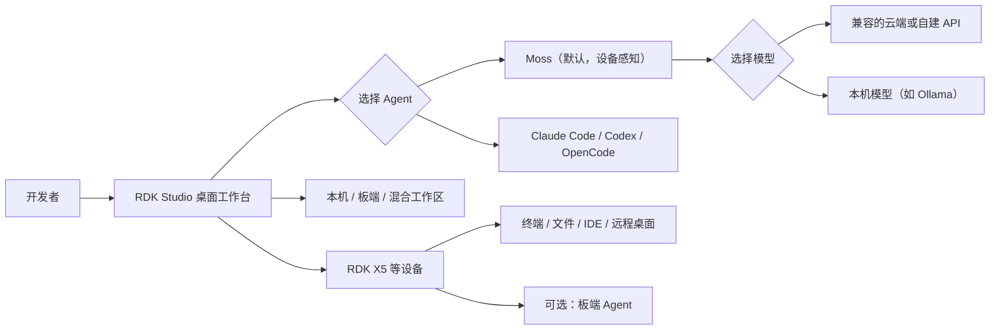

# RDK 第三课：RDK Studio 入门

> 课程版本：本课程基于 RDK Studio v1.3.3；后续界面与功能变化以后续版本为准
>
> 演示设备：RDK X5 8GB，使用 SSH 连接
>
> 课程目标：理解 RDK Studio、Moss、模型、外部 Agent 与板端 Agent 的关系，完成 X5 只读体检，并通过一句 Prompt 让 Moss 在 X5 BPU 上启动 USB 摄像头 YOLO 实时检测
>
> 建议学习时间：约 18 分钟
>
> 学习方式：概念讲解 + RDK Studio 实机操作

---

## 配套资源

| 资源 | 地址 | 用途 |
|---|---|---|
| RDK Studio 产品入口 | https://developer.d-robotics.cc/rdkstudio | 下载软件、查看产品信息 |
| RDK 文档资源中心 | https://developer.d-robotics.cc/rdk_doc_center/ | 查 RDK Studio 与各板卡官方手册 |
| RDK 课程 Demo（中文） | https://d-robotics.github.io/rdk-course-demos/zh/ | 阅读中文讲义和课程 Demo |
| RDK Course Demos (English) | https://d-robotics.github.io/rdk-course-demos/ | Read the English handbook and demos |
| D-Robotics GitHub | https://github.com/D-Robotics | 获取示例、TROS、ModelZoo 与文档源码 |

本课的原始 Markdown 讲义和 HTML 课件源文件也会存放在 GitHub 的 `rdk-course-demos` 仓库中。GitHub Pages 是发布后的阅读界面，仓库中的 Markdown 与 HTML 是可追踪、可维护的原始内容。

---

## 1. 本课要解决什么问题

连接一块 RDK 开发板之后，开发工作会涉及多个窗口：终端里看系统状态，文件工具里找日志，IDE 里改代码，浏览器里查文档，远程桌面里看图形界面，遇到问题再把信息复制给 AI。

RDK Studio 试图把这些动作放回同一个任务上下文中。你可以直接告诉它目标，让默认的 Moss Agent 结合当前项目、设备状态、文件和终端信息完成分析；需要深入操作时，再进入终端、文件工作区、代码编辑器或远程桌面。

本课不逐个朗读按钮，而是完成两个可核对的任务：

> 让 Moss 对当前连接的 RDK X5 做一次只读设备体检，并给出结构化结论。
>
> 再输入一句自然语言 Prompt，让 Moss 在 X5 BPU 上启动 YOLO，并在 Studio 内置浏览器中显示 USB 摄像头实时检测画面。

通过这条主线，我们会回答四个问题：

1. RDK Studio 到底是什么？
2. Moss、外部 Agent 和模型分别负责什么？
3. Studio 如何理解并操作当前 RDK 设备？
4. 哪些动作可以放心查看，哪些动作必须确认后再执行？

---

## 2. 完成本课后你能做到什么

完成本课后，你将能够：

1. 用一句话说明 RDK Studio 的定位；
2. 区分 RDK Studio、Moss、模型、外部 Agent 和板端 Agent；
3. 看懂新版工作台中的项目、设备、权限、工作方式、Agent 和模型状态；
4. 理解本机、板端和混合工作区的差别；
5. 让 Moss 对已连接的 X5 完成一次只读健康检查；
6. 用一句 Prompt 让 Moss 调用 X5 BPU 运行 USB 摄像头 YOLO 实时检测；
7. 实际打开终端、文件、代码编辑器和远程桌面，并判断各自适合的任务；
8. 使用“计划”或 “Spec”先审查复杂任务，再决定是否执行；
9. 在截图和问题反馈中避免泄露设备与账号信息。

---

## 3. RDK Studio 是什么

RDK Studio 是面向机器人与 RDK 设备的 AI 原生桌面工作台。它把 AI Agent、项目工作区、设备连接、终端、文件、代码编辑器、远程桌面、系统烧录、本地模型和板端 Agent 放在同一个原生应用中。

如果你熟悉 Codex，可以把 RDK Studio 暂时理解成“面向 RDK 设备的 Codex 式开发工作台”。这个类比有助于理解自然语言驱动的开发体验，但不是完整的产品定义，因为：

- RDK Studio 默认使用具备设备上下文的 Moss；
- Codex 是 Studio 当前可选的外部 Agent 之一，不是 Studio 本身；
- Studio 还负责设备连接、烧录、远程桌面等机器人开发专用流程；
- Agent 和模型都可以按环境切换，并不是绑定在同一个固定服务上。

### 3.1 它与普通远程开发工具的差别

普通工具往往只解决一个环节，例如 SSH、文件传输或代码编辑。RDK Studio 的价值是让这些能力围绕同一个任务协同：

```text
你的目标
  ↓
RDK Studio 工作台
  ├─ 当前项目与工作目录
  ├─ 当前 RDK / Linux 设备
  ├─ Moss 或外部 Agent
  ├─ 云端、自建或本地模型
  └─ 终端、文件、IDE、远程桌面、烧录等工具
```

它减少工具切换，但不会取消开发者的判断。命令、文件写入、设备配置和烧录仍需要看到过程、核对影响，并在高风险动作前确认。

### 3.2 Studio 的能力边界

RDK Studio 主要负责本机开发、设备接入、烧录、运行调试和 Agent 协作。模型训练、数据集管理、模型量化和 HBM 编译属于云平台或模型工具链，本课不展开。

---

## 4. 一张图看懂核心架构



### 4.1 RDK Studio

Studio 是桌面应用和统一入口，负责组织任务、项目、设备、Agent、模型与工具。

### 4.2 Moss

Moss 是 RDK Studio 默认的原生设备感知 Agent。它不仅回答文字问题，还可以结合当前设备、工作目录、诊断信息和可用工具处理开发任务。

### 4.3 外部 Agent

录制使用的 v1.3.3 界面还可以选择 Claude Code、Codex 和 OpenCode。它们运行在用户电脑上，复用本机对应 CLI 的登录与模型配置；Studio 为其桥接 RDK 设备上下文和知识工具。后续版本可能调整这些入口的名称或位置，请以对应版本客户端界面为准。

因此，选择外部 Agent 前，应先保证对应 CLI 已在本机正确安装、登录并能够工作。不要把 API Key 粘贴到普通对话中。

### 4.4 模型

模型为 Agent 提供推理能力，Agent 则负责组织任务循环、选择工具并处理结果。二者是两层选择：更换 Agent 不等于自动更换模型，更换模型也不会把 Moss 变成 Codex。

Moss 可在兼容配置下使用：

- 登录后可用的推荐模型；
- 其他厂商提供的兼容云端 API；
- 团队自建或私有部署的兼容模型服务；
- 电脑本机运行的模型，例如通过 Ollama 提供的模型。

板端 Agent 使用的模型需要在板端 Agent 页面单独配置，不要与 PC 端 Moss 的模型混为一谈。

### 4.5 板端 Agent

在录制使用的 v1.3.3 界面中，“板端 Agent”是管理设备侧 Agent 的统称入口。设备侧可以使用 Moss，也可以安装 OpenClaw 等板端 Agent，用于更贴近设备、长期运行、设备技能或消息渠道协同的任务。当前公开手册可能主要以 OpenClaw 作为板端 Agent 示例，课程以实际演示客户端中的名称为准。

普通 SSH、终端、文件、代码编辑器和本课的设备体检都不要求先安装板端 Agent。

---

## 5. 开始前的环境与连接检查

### 5.1 桌面端环境

RDK Studio 当前支持：

- Windows 10 / 11 64 位；
- macOS Apple Silicon（M 系列芯片）。

目前不提供 32 位 Windows、Windows 7/8/8.1、Intel Mac 或 Linux/Ubuntu 桌面客户端安装包。请从 D-Robotics 官方入口下载安装包。

### 5.2 设备接入方式

| 场景 | 推荐方式 | 说明 |
|---|---|---|
| 已知 IP，设备能通过网络访问 | SSH | 最通用，适合完整工作区、终端、文件和 IDE |
| X5 / S100 在电脑旁，没有局域网 IP | Type-C 直连 | 仅适用于支持的板型；X3 不支持 Type-C 直连 |
| 系统网络不可达，只需查看启动信息 | 串口 | 主要用于日志和救援，不等价于完整设备接入 |
| 设备没有可用系统或需要重刷 | 烧录向导 | 高风险流程，应备份数据并确认目标介质 |

SSH 也可接入通用 Linux 主机、Jetson、Raspberry Pi 或 Rockchip 设备。非 RDK 设备可以使用通用 SSH 工作区能力；RDK 专属的板型识别、BPU/TROS 知识、烧录和板端 Agent 部署不属于通用设备能力。

### 5.3 动手前检查

1. X5 已正常启动，并能稳定 SSH 登录；
2. Studio 中设备显示在线，且名称、板型与目标设备一致；
3. 当前项目与工作目录正确；
4. Moss 和所选模型能完成一次简单回复；
5. USB 摄像头已连接 X5，并能正常输出画面；
6. 当前页面、终端和文件中没有需要对外隐藏的账号、地址、Wi-Fi、密码、API Key 或内部服务信息。

---

## 6. 看懂 v1.3.3 工作台

新版工作台以“任务”为中心。开始任务前，先检查输入区附近和底部状态。

| 状态 | 要确认什么 | 为什么重要 |
|---|---|---|
| 项目 / 工作区 | 当前任务在哪个目录中工作 | 决定 Agent 可以理解和操作的代码范围 |
| 设备 | 是否选中了正确且在线的 X5 | 决定命令实际发往哪台设备 |
| 权限 | 当前允许哪些操作、何时需要确认 | 避免无意执行高风险动作 |
| 工作方式 | 执行、计划或 Spec | 决定先做、先分析，还是先产出可审批规范 |
| Agent | Moss 或外部 Agent | 决定任务循环和可用工具 |
| 模型 | 当前 Agent 使用的推理模型 | 影响能力、速度、成本和数据边界 |

### 6.1 项目工作区

根据项目位置，工作区可以理解为三种形态：

- **本机工作区**：代码和资料主要在电脑上；
- **板端工作区**：Agent 围绕设备上的目录工作；
- **混合工作区**：本机项目与板端运行环境共同参与任务。

选择工作区时先回答：代码在哪里、程序在哪里运行、输出需要保存在哪里。

### 6.2 录制版本中的三种工作方式

| 工作方式 | 适合任务 | 建议用法 |
|---|---|---|
| 执行 | 目标明确、风险低、希望直接完成 | 本课的只读体检和 YOLO 任务使用这一模式 |
| 计划 | 任务复杂或影响不明确 | 先列步骤、风险和验证方式，不立即改动 |
| Spec | 需求需要形成可审查规范后再实施 | 适合功能开发、跨文件修改和正式交付 |

本课录制使用的 v1.3.3 界面将三种方式标为“执行、计划、Spec”；后续版本可能重新组织工作方式和模型模式。如果任务包含安装软件、修改网络、重启服务、覆盖文件或烧录设备，优先使用“计划”或 “Spec”，并在执行前核对目标、影响和回退方式。

---

## 7. 主演示：让 Moss 对 X5 做只读体检

### 7.1 演示任务

在确认当前设备为在线 X5 后，选择 Moss、可用模型和“执行”方式，输入：

```text
请对当前连接的 RDK X5 做一次只读设备体检。检查设备与 SSH 状态、CPU、内存、温度、磁盘和网络，只读取信息，不安装软件、不修改配置、不重启服务。最后按“正常、需关注、建议处理”给出结论，并列出你实际检查过的项目。
```

这条提示词包含四个关键部分：

1. **对象明确**：当前连接的 RDK X5；
2. **检查范围明确**：连接、CPU、内存、温度、磁盘、网络；
3. **安全边界明确**：只读，不安装、不修改、不重启；
4. **输出格式明确**：结论分级，并列出已检查项目。

### 7.2 观察 Moss 的执行过程

不要只等待最终回答，还要观察：

- 当前设备标签是否仍然指向目标 X5；
- Moss 是否说明将检查哪些项目；
- 工具或终端动作是否都是读取状态；
- 某项检查失败时，Moss 是否明确说明“未验证”，而不是猜测；
- 最终结论是否能与 Studio 的设备指标交叉核对。

阅读结果时不需要逐行分析全部命令输出，重点确认“检查了什么”和“结果说明什么”。

### 7.3 合格的结果应该包含什么

| 检查项 | 期望信息 | 判断方式 |
|---|---|---|
| 设备与 SSH | 在线状态、板型或系统可访问性 | 明确成功、失败或未验证 |
| CPU | 负载或占用概况 | 是否存在持续异常高负载 |
| 内存 | 总量、已用、可用概况 | 是否接近资源上限 |
| 温度 | 当前可读取的关键温度 | 是否超过正常开发状态下的预期 |
| 磁盘 | 主要分区使用率和剩余空间 | 是否存在空间不足风险 |
| 网络 | 接口、地址或连通概况 | 不公开真实地址，只说明状态 |
| 结论 | 正常、需关注、建议处理 | 每条建议能追溯到实际检查结果 |

一次成功的演示不要求所有指标都“正常”，而要求结论真实、边界清楚、结果可核对。

### 7.4 如果设备离线

设备显示“待验证”或“离线”时：

1. 检查电脑和设备是否处于预期网络；
2. 核对设备地址、SSH 用户和认证方式；
3. 确认设备已开机且 SSH 服务可用；
4. 重新验证连接后再次执行设备体检；
5. 未恢复前，可以让 Moss 分析已有日志或制定排查计划，但不要声称已经执行了板端检查。

恢复连接前，可以让 Moss 分析已有日志或生成排查计划；需要读取板端状态的项目必须在设备重新在线后执行。

---

## 8. 主演示：一句 Prompt 启动 X5 BPU YOLO

### 8.1 演示目标

第二个主演示展示 Moss 如何把一句目标转化为板端可见结果。在 PC 端 RDK Studio 工作台向默认 Moss 输入一句 Prompt，要求使用 X5 BPU 运行 YOLO，并调用连接在 X5 上的 USB 摄像头进行实时检测。

本课不讲解 Moss 最终选择的仓库、模型文件、安装命令、服务端口或 WebSocket 实现。演示重点是自然语言任务、X5 BPU 执行和最终实时画面。

### 8.2 一行 Prompt 的内容要求

这行 Prompt 必须明确包含：

- 目标设备是当前连接的 RDK X5；
- 推理由 X5 BPU 执行；
- 输入来自连接在 X5 上的 USB 摄像头；
- 任务是 YOLO 实时目标检测；
- 完成后在 RDK Studio 内置浏览器中打开实时检测页面。

Moss 自主选择成熟方案，因此 Prompt 不需要指定具体 Demo 名称和启动命令。

### 8.3 Moss 自动完成的链路

```text
PC 端 Studio 工作台输入 Prompt
  → Moss 连接当前 X5
  → 选择并启动成熟的 YOLO 方案
  → 使用 X5 BPU 执行推理
  → 读取 USB 摄像头实时画面
  → Studio 自动打开内置浏览器
  → 浏览器实时检测页面显示检测框和类别
```

### 8.4 成功标准

以下条件必须同时成立：

1. 执行设备是当前连接的 RDK X5；
2. YOLO 推理由 X5 BPU 执行，不是 CPU 推理；
3. 输入来自连接在 X5 上的 USB 摄像头；
4. RDK Studio 自动打开内置浏览器；
5. 浏览器实时检测页面持续显示摄像头画面；
6. 画面中出现检测框和类别结果。

只打印终端日志、只打开摄像头、只生成单张结果图片或使用 CPU 推理，都不算完成本段演示。

## 9. 四项开发工具的最短实操

自然语言任务适合描述目标和串联信息；专业工具适合查看细节、直接操作或持续开发。二者不是互相替代。

| 需求 | 优先入口 | 使用建议 |
|---|---|---|
| 汇总设备状态、解释报错、规划排障 | Moss 工作台 | 先说明目标、范围、安全边界和输出格式 |
| 运行命令、观察实时日志 | 终端 | 适合熟悉命令的用户，也可把输出交给 Moss 分析 |
| 浏览、上传、下载或小范围编辑文件 | 文件工作区 | 本课打开无敏感信息的目录和一个文本文件，不做修改 |
| 持续编码、搜索工程、调试项目 | 代码编辑器 / code-server | 本课打开普通项目目录并展示编辑区，不保存修改 |
| 操作板端图形界面 | 远程桌面 | 本课连接 X5、打开板端桌面并操作一个窗口 |
| 写入系统镜像 | 烧录 | 先备份、核对板型、镜像和目标介质；本课不实际烧录 |
| 设备侧长期 Agent、技能或消息渠道 | 板端 Agent | 进阶能力，单独配置、诊断和维护 |

### 9.1 终端：30 秒只读检查

打开当前 X5 的终端，执行一条只读命令，查看系统或 BPU 状态。成功标准是命令在正确设备上返回可读结果。不得在这一段安装软件、修改配置或重启服务。

### 9.2 文件工作区

进入 X5 上一个无敏感信息的目录，打开一个普通文本文件。成功标准是目录列表和文件内容均可读取；本课不编辑、不上传、不下载文件。

### 9.3 代码编辑器

使用 code-server 打开 X5 上一个普通项目目录，展示目录树、搜索、编辑区域和终端入口。成功标准是项目内容正常加载；本课不保存代码修改。使用此功能时，目标设备必须在线且 code-server 服务必须能够连接。

### 9.4 远程桌面

选择当前 X5，连接并打开板端桌面，再操作一个窗口证明画面可以交互。成功标准是板端桌面正常显示且鼠标或窗口操作生效。远程桌面不等于 SSH，也不代替终端排障；不要在截图、共享屏幕或问题反馈中公开远程桌面密码。

### 9.5 烧录

烧录页会引导选择板型、镜像和目标介质。X3、X5、S100 等板型的流程并不完全相同，S100 页面会引导准备相应烧录工具。烧录会覆盖目标介质数据，因此本课只浏览流程，不选择真实目标盘，不点击开始写入。

---

## 10. 安全、权限与隐私

### 10.1 从只读任务开始

第一次使用 Agent 操作设备时，建议先完成以下任务：

- 查看系统版本和设备信息；
- 查看 CPU、内存、温度和磁盘；
- 读取日志并解释错误；
- 总结项目或 Git 变更；
- 让 Agent 先生成计划。

### 10.2 高风险动作的确认清单

涉及以下动作时，应先停下来核对：

- 安装、升级或删除软件包；
- 修改网络、启动项、权限或系统服务；
- 重启设备或服务；
- 覆盖、移动或删除文件；
- 烧录 TF 卡、eMMC 或其他介质；
- 修改板端 Agent、模型或消息渠道配置；
- 向外部服务发送文件、日志或设备信息。

至少确认目标设备、目标路径或介质、影响范围、数据备份、回退方式和验证方法。

### 10.3 分享与问题反馈时的脱敏

不要在截图、共享屏幕、公开文档或问题反馈中公开：

- 设备 IP、SSH 用户名和认证信息；
- Wi-Fi 名称、密码和网络拓扑；
- API Key、Token、内部 Base URL 和组织标识；
- 远程桌面密码；
- 个人账号、最近任务、私有仓库和本地绝对路径；
- 模型额度、账单或内部服务名称。

---

## 11. 板端 Agent 什么时候才需要

PC 端 Moss 随 RDK Studio 运行，通过当前连接理解和操作设备。“板端 Agent”是 RDK Studio 中管理设备侧 Agent 的入口，设备侧可以使用 Moss，也可以安装 OpenClaw 等板端 Agent。PC 端 Agent 与设备侧 Agent 相互独立。

适合使用板端 Agent 的情况包括：

- 希望设备侧保持一个长期运行的 Agent；
- 需要管理或同步设备技能；
- 任务强依赖当前设备，并希望从板端直接发起；
- 需要接入受控的消息渠道完成远程协同。

本课只打开板端 Agent 页面，说明 Moss、OpenClaw 等设备侧内容及其用途，不执行安装、升级、修复、重启、模型同步、渠道配置或板端任务。是否启用板端 Agent，应根据网络、权限、安全和运维要求单独评估。

---

## 12. 常见问题

### 12.1 Moss 和模型是同一回事吗？

不是。Moss 是组织任务、使用工具和处理结果的 Agent；模型提供推理能力。一个 Agent 可以在兼容条件下切换不同模型。

### 12.2 Codex 是 RDK Studio 的后端吗？

不是。Moss 是默认原生 Agent。Codex 是当前可选的外部 Agent 之一，复用用户本机的 Codex CLI 环境。

### 12.3 可以使用其他厂商的云端 API 吗？

可以接入 RDK Studio 所支持兼容接口的其他厂商云端 API 或团队自建模型服务。配置使用 v1.3.3“AI 引擎”页面提供的字段和协议。不要把密钥放进普通对话、代码示例、截图或共享屏幕。

### 12.4 不连接开发板还能使用吗？

可以做知识问答、阅读资料、分析已有日志或生成计划；需要读取或操作板端状态时，必须先恢复设备连接。

### 12.5 必须安装板端 Agent 才能用终端和文件吗？

不需要。SSH、终端、文件、代码编辑器和 Moss 的常规设备任务都可以独立使用。

### 12.6 串口已经打开，为什么工作台仍显示设备离线？

串口用于读取本机连接到开发板的日志，不等价于完整 SSH 设备接入。完整工作区、文件、IDE 和 Agent 板端操作需要 SSH 或受支持的 Type-C 连接。

### 12.7 Agent 给出的指标与页面卡片不同怎么办？

先确认采样时间、指标含义和目标设备是否一致。动态指标会随时间变化；如果差异明显，让 Agent 列出实际命令和采样时间，并重新检查，不要直接选一个结果相信。

---

## 13. 术语表

| 术语 | 本课定义 |
|---|---|
| RDK Studio | 面向机器人与 RDK 设备的 AI 原生桌面工作台 |
| Moss | Studio 默认的原生设备感知 Agent |
| 外部 Agent | 运行在用户电脑上的 Claude Code、Codex、OpenCode 等可选 Agent |
| 模型 | 为 Agent 提供推理能力的云端、自建或本地模型服务 |
| 工作区 | 当前任务使用的本机目录、板端目录或二者组合 |
| 执行 | 直接处理明确任务的工作方式 |
| 计划 | 先分析步骤、风险和验证方法的工作方式 |
| Spec | 先形成可审批规范，再进入实施的工作方式 |
| 板端 Agent | RDK Studio 中管理设备侧 Agent 的入口；设备侧可以使用 Moss，也可以安装 OpenClaw 等 Agent |
| SSH | 最通用的远程设备连接方式 |
| code-server | 在浏览器式界面中打开设备侧代码工作区的服务 |

---

## 14. 本课完成标准与下一步

如果你已经完成以下检查，本课目标就达成了：

- 能准确区分 Studio、Moss、外部 Agent、模型和板端 Agent；
- 能确认当前项目、设备、权限、工作方式、Agent 和模型；
- 已让 Moss 对 X5 完成一次只读体检；
- 最终结论包含连接、CPU、内存、温度、磁盘和网络；
- 已让 Moss 使用 X5 BPU 启动 USB 摄像头 YOLO，并在 Studio 内置浏览器中看到带检测框和类别的实时画面；
- 已实际完成终端只读检查、文件读取、code-server 项目打开和远程桌面交互；
- 能解释烧录与板端 Agent 的用途和操作边界；
- 知道高风险任务应先使用“计划”或 “Spec”审查；
- 全程没有泄露账号、设备地址、Wi-Fi、密码或密钥。

下一步可以选择一个真实但低风险的开发任务，例如让 Moss 读取一段错误日志、总结某个 Demo 的 README，或先为一个板端程序生成执行计划。保持同样的任务表达方式：

```text
明确对象 → 说明目标 → 限定操作边界 → 规定输出格式 → 核对结果
```

课程讲义与后续 Demo 将持续发布在：

- 中文：https://d-robotics.github.io/rdk-course-demos/zh/
- English：https://d-robotics.github.io/rdk-course-demos/
