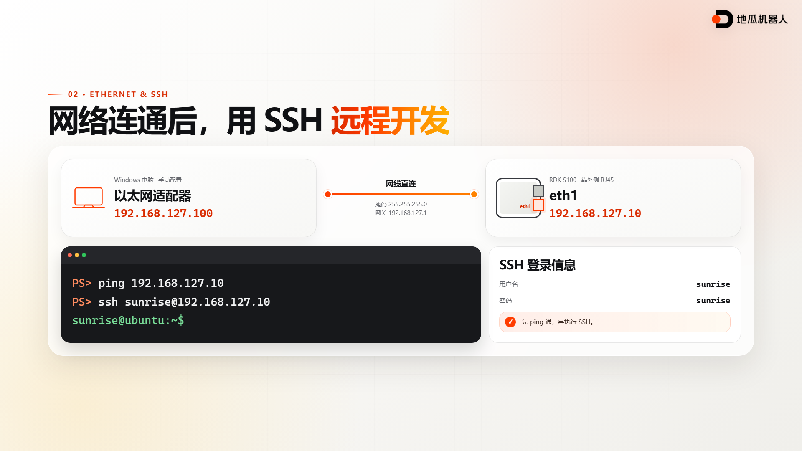
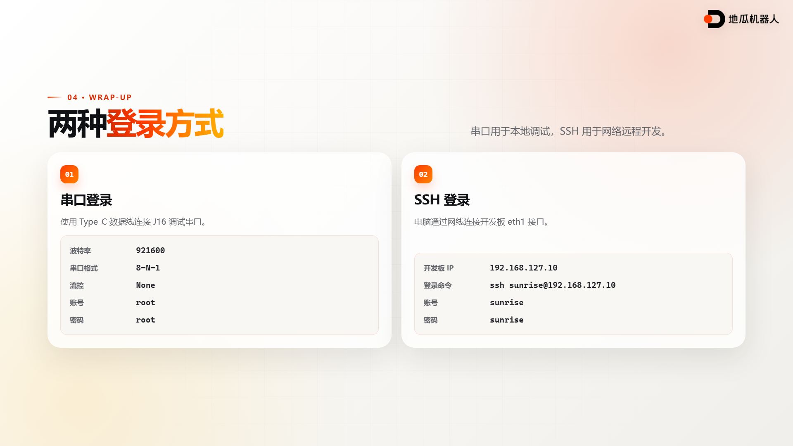

# Remote Access for RDK S100

After flashing the system image, you can perform most daily development tasks from your computer. A remote terminal lets you edit code, transfer files, run programs, and inspect logs without keeping a monitor, keyboard, and mouse connected to the board.

This lesson first uses the J16 debug serial port to access the system, then configures a wired connection through eth1, and finally logs in over SSH. The serial console does not depend on the network, so it is useful for initial setup and troubleshooting. SSH requires a working network connection and is better suited to daily development.

## Course demo

- [Browse the Chinese slide demo, speaker script, and recording assets](https://github.com/D-Robotics/rdk-course-demos/tree/develop/01_beginner/06_remote_connection)






## Prerequisites

- An RDK S100 that has been flashed and boots successfully
- A USB Type-C cable that supports data transfer
- An Ethernet cable
- A Windows computer
- MobaXterm, PuTTY, or another serial terminal application
- The CH340 serial driver

RDK images normally provide the following default accounts. The credentials may vary with the image version and source, so also check the release notes for your image.

| Privilege | Username | Password |
| --- | --- | --- |
| Standard user | `sunrise` | `sunrise` |
| Superuser | `root` | `root` |

This lesson uses `root` to inspect the system through the serial console and `sunrise` for daily work over SSH.

## Connect to the J16 debug serial port

The USB Type-C `J16` port on the RDK S100 supports system flashing as well as Main-domain and MCU-domain debugging. Two onboard CH340 chips convert the Main-domain and MCU-domain debug serial ports into USB serial devices. To access Ubuntu in this lesson, select the Main-domain channel that displays the Linux boot log.

In this procedure, J16 is used as a debug serial port. It cannot be configured with an IP address like an Ethernet interface.

### Connect and identify the port

1. Connect the computer to the board's `J16` port with the Type-C data cable.
2. Open Windows Device Manager and expand the list of ports.
3. Confirm that a new CH340 or CH341 serial device appears.
4. Note the newly assigned COM port number.

It is normal for more than one serial device to appear. If the selected port does not show Linux output, try the other newly added port.

If no new COM port appears in Device Manager, confirm that the cable supports data transfer, then check the CH340 driver.

### Configure the serial terminal

The following example uses MobaXterm. Create a Serial session and apply these settings.

| Setting | Value |
| --- | --- |
| Serial port | The COM port shown in Device Manager |
| Baud rate | `921600` |
| Data bits | `8` |
| Parity | `None` |
| Stop bits | `1` |
| Flow control | `None` |

Open the session and press Enter once. The terminal should display a login prompt or a Linux shell.

At the login prompt, enter `root` as both the username and password. The terminal does not display asterisks or other characters while you type the password. Press Enter when finished.

After logging in, check the address assigned to eth1.

```bash
ip -br addr show eth1
```

With the default configuration, the output should include `192.168.127.10/24`. You can also list all network interfaces with the following command.

```bash
ifconfig -a
```

## Connect the eth1 wired network

The RDK S100 has two Gigabit Ethernet ports. Their default configurations are different. This lesson uses eth1 because it has a predefined static address.

| Physical port | Linux interface | Default configuration | Default address |
| --- | --- | --- | --- |
| U43 | eth0 | DHCP or manual configuration | None |
| U45 | eth1 | Static address | `192.168.127.10` |

The outer RJ45 port on the board corresponds to eth1. Connect the Ethernet cable to this port and connect the other end directly to the computer.


The default eth1 network settings are shown below.

| Setting | Value |
| --- | --- |
| IP address | `192.168.127.10` |
| Subnet mask | `255.255.255.0` |
| Gateway | `192.168.127.1` |

### Configure a static address on the computer

1. Open the Windows Network Connections page.
2. Find the Ethernet adapter connected to the board.
3. Open the adapter properties.
4. Double-click Internet Protocol Version 4.
5. Select manual address configuration and enter the following values.

| Setting | Value |
| --- | --- |
| Computer IP address | `192.168.127.100` |
| Subnet mask | `255.255.255.0` |
| Default gateway | `192.168.127.1` |

The computer and board must be on the same subnet and must use different IP addresses. Do not assign the board's `192.168.127.10` address to the computer.

### Verify network connectivity

Open PowerShell and run the following command.

```powershell
ping 192.168.127.10
```

Replies from `192.168.127.10` confirm that the computer can reach the board. Complete this check successfully before attempting an SSH login.

If the request times out, verify that the cable is connected to eth1, the computer uses `192.168.127.100`, the subnet mask is correct, and Windows Firewall is not blocking the current network.

## Log in over SSH

After the ping test succeeds, run the following command in PowerShell.

```powershell
ssh sunrise@192.168.127.10
```

You can also create an SSH session in MobaXterm with `192.168.127.10` as the remote host and `sunrise` as the username.

On the first connection, SSH asks you to confirm the board's host key. Enter `yes`, press Enter, and then enter the password `sunrise`. No characters appear while you type the password.

A prompt similar to the following confirms that the SSH login succeeded.

```text
sunrise@ubuntu:~$
```

Run these commands to verify the current user and network interface.

```bash
whoami
hostname
ip -br addr show eth1
```

`whoami` should print `sunrise`, and the eth1 output should include `192.168.127.10/24`.

## Transfer files

After SSH is working, use SCP on the computer to copy files to the board. The following example sends `hello.txt` from the current directory to the standard user's home directory.

```powershell
scp .\hello.txt sunrise@192.168.127.10:/home/sunrise/
```

Enter the password `sunrise`. After the transfer finishes, check the file from the SSH terminal.

```bash
ls -l /home/sunrise/hello.txt
```

Add the `-r` option to copy an entire directory.

```powershell
scp -r .\demo sunrise@192.168.127.10:/home/sunrise/
```

## Troubleshooting

### The computer does not detect a COM port

Confirm that the Type-C cable supports data transfer and reinstall the CH340 driver. You can also try another USB port or cable to rule out a hardware problem.

### The serial output is garbled

Confirm a baud rate of `921600`, `8` data bits, no parity, `1` stop bit, and no flow control.

### The serial terminal shows no output

Confirm that you selected the Main-domain debug channel. Open the serial session before restarting the board so that you can capture the complete Linux boot log.

### The ping test fails

Confirm that the cable is connected to the outer eth1 port. Then verify that the computer and board are both on the `192.168.127.0/24` subnet and do not use the same IP address.

### SSH reports Connection refused

Log in through the serial console and check the SSH service.

```bash
systemctl status ssh
```

If the service is not running, try starting it.

```bash
systemctl start ssh
```

### PowerShell cannot find the ssh command

Install the OpenSSH Client from Windows Optional Features, or create an SSH session in MobaXterm. The remote address and login credentials are the same with either tool.

### SSH reports Permission denied

Use `sunrise` as both the username and password for a normal SSH login. Check the capitalization of the username and remember that the password has no visible feedback while you type it.

### The host identity warning appears after reflashing

Reflashing can change the board's SSH host key. After confirming that the target is still your own board, remove the old record from the computer.

```powershell
ssh-keygen -R 192.168.127.10
```

Then run the SSH login command again.

## Related resources

- [RDK S100 hardware interface documentation](https://developer.d-robotics.cc/rdk_doc/en/rdk_s/Quick_start/hardware_introduction/rdk_s100/)
- [RDK S100 remote login documentation](https://developer.d-robotics.cc/rdk_s_doc/en/Quick_start/remote_login)
