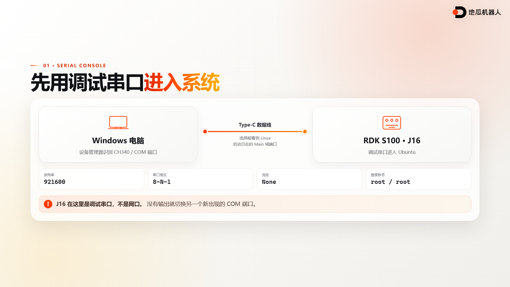
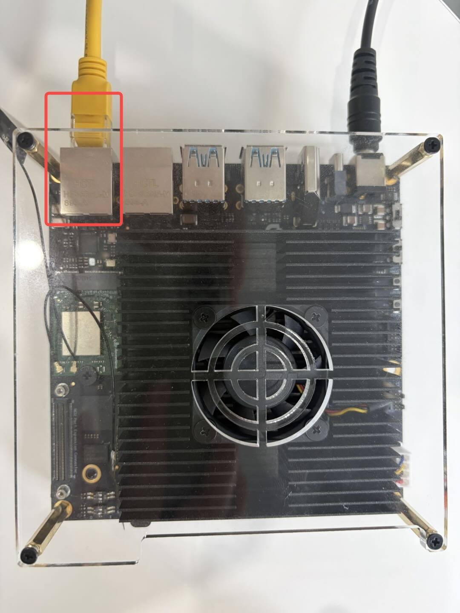

# RDK S100 远程连接


系统烧录完成以后，日常开发通常在电脑上进行。代码编辑、文件传输、程序运行和日志查看都可以通过远程终端完成，开发板不需要一直连接显示器和键鼠。

本课程先通过 J16 调试串口进入系统，再配置 eth1 有线连接，最后使用 SSH 登录。串口不依赖网络，适合首次连接和故障排查。SSH 建立在网络连通的基础上，适合后续开发。

## 配套演示

- [查看中文演示页、讲课稿和全部录课素材](https://github.com/D-Robotics/rdk-course-demos/tree/develop/01_beginner/06_remote_connection)

### 串口连接页面



### SSH 连接页面


### 课程总结页面


## 准备工作

- 已经完成系统烧录，开发板可以正常启动
- 一根支持数据传输的 USB Type-C 线
- 一根网线
- 一台 Windows 电脑
- MobaXterm、PuTTY 或其他串口终端工具
- CH340 串口驱动

RDK 系统通常提供下面两组默认账号。具体账号可能随镜像版本和来源变化，使用前请同时查看镜像发行说明。

| 权限 | 用户名 | 密码 |
| --- | --- | --- |
| 普通用户 | `sunrise` | `sunrise` |
| 超级用户 | `root` | `root` |

本讲通过串口检查系统时使用 `root`，通过 SSH 进行日常操作时使用 `sunrise`。

## 通过 J16 连接调试串口

RDK S100 的 USB Type-C `J16` 接口同时用于系统烧录、Main 域调试和 MCU 域调试。板上两颗 CH340 芯片会把 Main 域和 MCU 域的调试串口转换成 USB 串口。本讲要进入 Ubuntu，因此需要选择能够显示 Linux 启动日志的 Main 域通道。

J16 在这一步承担的是调试串口功能。它不能按普通网口的方式配置 IP。

### 连接并识别端口

1. 使用 Type-C 数据线连接电脑和开发板的 `J16` 接口。
2. 打开 Windows 设备管理器，展开端口列表。
3. 确认列表中出现新的 CH340 或 CH341 串口设备。
4. 记下新出现的 COM 端口号。

主机上出现多个串口设备属于正常现象。连接后看不到 Linux 输出时，可以切换到另一个新出现的端口再试。

如果设备管理器没有出现新的 COM 端口，先检查数据线是否支持数据传输，再检查 CH340 驱动。

### 配置串口终端

以 MobaXterm 为例，新建一个 Serial 会话，并填写下面的参数。

| 设置 | 参数 |
| --- | --- |
| 串口 | 设备管理器中识别到的 COM 端口 |
| 波特率 | `921600` |
| 数据位 | `8` |
| 奇偶校验 | `None` |
| 停止位 | `1` |
| 流控 | `None` |

打开会话后按一次回车。正常情况下，终端会显示登录提示或 Linux 命令行。

看到登录提示后输入用户名 `root`，密码也输入 `root`。输入密码时终端不会显示星号或其他字符，输完直接按回车。

登录成功后查看 eth1 的地址。

```bash
ip -br addr show eth1
```

默认配置下，输出中应当包含 `192.168.127.10/24`。也可以使用下面的命令查看全部网络接口。

```bash
ifconfig -a
```

## 连接 eth1 有线网络

RDK S100 提供两个千兆 RJ45 网口。两个网口的默认配置不同，本讲使用带有固定地址的 eth1。

| 物理接口 | 系统名称 | 默认配置 | 默认地址 |
| --- | --- | --- | --- |
| U43 | eth0 | DHCP 或手动配置 | 无 |
| U45 | eth1 | 静态地址 | `192.168.127.10` |

开发板靠外侧的 RJ45 网口对应 eth1。把网线插入这个网口，另一端直接连接电脑。



eth1 的默认网络参数如下。

| 设置 | 参数 |
| --- | --- |
| IP 地址 | `192.168.127.10` |
| 子网掩码 | `255.255.255.0` |
| 网关 | `192.168.127.1` |

### 设置电脑的静态地址

1. 打开 Windows 网络连接页面。
2. 找到这根网线对应的以太网适配器。
3. 打开适配器属性。
4. 双击 Internet 协议版本 4。
5. 选择手动填写地址，并使用下面的参数。

| 设置 | 参数 |
| --- | --- |
| 电脑 IP 地址 | `192.168.127.100` |
| 子网掩码 | `255.255.255.0` |
| 默认网关 | `192.168.127.1` |

电脑和开发板需要处于同一网段，同时必须使用不同的 IP。电脑不能填写开发板正在使用的 `192.168.127.10`。

### 检查网络连通性

打开 PowerShell，执行下面的命令。

```powershell
ping 192.168.127.10
```

看到来自 `192.168.127.10` 的回复，说明电脑已经能够访问开发板。SSH 登录必须等到这一步成功以后再进行。

如果请求一直超时，依次检查网线是否插在 eth1、电脑地址是否为 `192.168.127.100`、子网掩码是否正确，以及 Windows 防火墙是否拦截了当前网络。

## 通过 SSH 登录

网络测试通过后，在 PowerShell 中执行下面的命令。

```powershell
ssh sunrise@192.168.127.10
```

也可以在 MobaXterm 中新建 SSH 会话，把远端主机填写为 `192.168.127.10`，用户名填写为 `sunrise`。

第一次连接时，SSH 会要求确认开发板的主机密钥。输入 `yes` 并按回车，然后输入密码 `sunrise`。密码输入过程中没有字符回显，属于正常现象。

看到类似下面的提示符，说明 SSH 登录成功。

```text
sunrise@ubuntu:~$
```

执行下面的命令确认当前用户和网络接口。

```bash
whoami
hostname
ip -br addr show eth1
```

`whoami` 应当输出 `sunrise`，eth1 的输出中应当包含 `192.168.127.10/24`。

## 传输文件

SSH 连通以后，可以在电脑上使用 SCP 把文件复制到开发板。下面的示例把当前目录中的 `hello.txt` 发送到普通用户的主目录。

```powershell
scp .\hello.txt sunrise@192.168.127.10:/home/sunrise/
```

输入密码 `sunrise`。传输完成后，在 SSH 终端中检查文件。

```bash
ls -l /home/sunrise/hello.txt
```

需要传输整个目录时，为 `scp` 增加 `-r` 参数。

```powershell
scp -r .\demo sunrise@192.168.127.10:/home/sunrise/
```

## 常见问题

### 电脑没有识别出 COM 端口

确认 Type-C 线支持数据传输，并重新安装 CH340 驱动。也可以更换电脑 USB 接口或数据线排除硬件问题。

### 串口输出乱码

确认波特率为 `921600`，数据位为 `8`，无校验，停止位为 `1`，流控关闭。

### 串口窗口没有任何输出

确认当前连接的是 Main 域调试通道。先打开串口会话，再重启开发板，以便看到完整的 Linux 启动日志。

### ping 无法连通

先确认网线插在靠外侧的 eth1 网口。随后检查电脑和开发板是否位于 `192.168.127.0/24` 网段，并确认两端没有使用相同的 IP。

### SSH 提示 Connection refused

先通过串口登录开发板，检查 SSH 服务状态。

```bash
systemctl status ssh
```

服务没有运行时，可以尝试启动。

```bash
systemctl start ssh
```

### PowerShell 找不到 ssh 命令

在 Windows 可选功能中安装 OpenSSH 客户端，或者直接使用 MobaXterm 新建 SSH 会话。无论使用哪种工具，远端地址和登录账号都保持不变。

### SSH 提示 Permission denied

日常 SSH 登录使用用户名 `sunrise` 和密码 `sunrise`。检查用户名大小写，并注意密码输入时没有回显。

### 重新烧录后出现主机身份警告

重新烧录可能会改变开发板的 SSH 主机密钥。确认连接目标仍然是自己的开发板以后，在电脑上删除旧记录。

```powershell
ssh-keygen -R 192.168.127.10
```

随后重新执行 SSH 登录命令。


## 相关资料
- [RDK S100 硬件接口说明](https://developer.d-robotics.cc/rdk_doc/rdk_s/Quick_start/hardware_introduction/rdk_s100/)
- [RDK S100 远程登录说明](https://developer.d-robotics.cc/rdk_s_doc/Quick_start/remote_login)
