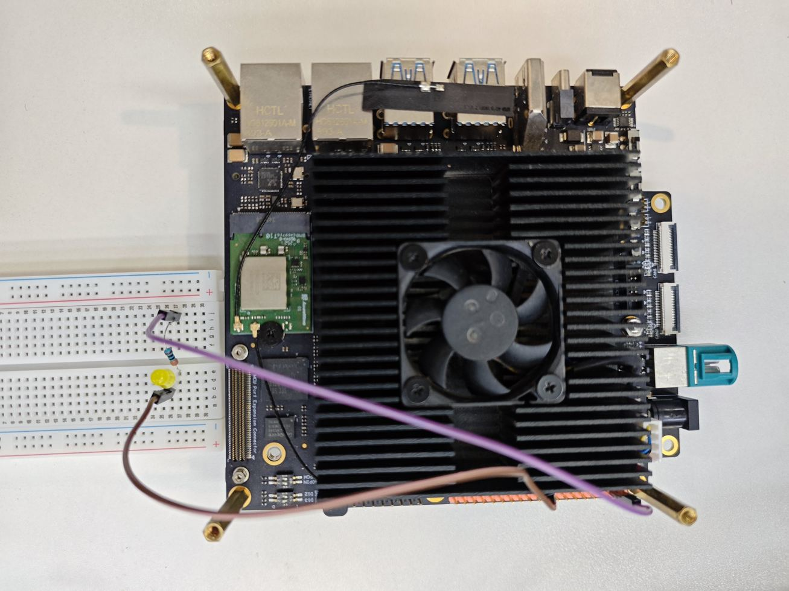
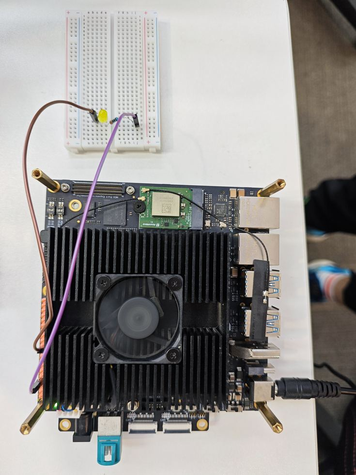

# RDK S100 GPIO and PWM

This handbook follows the recorded course slides, including wiring, commands, measured results, and the scope of verification.

[Source slides](https://github.com/D-Robotics/rdk-course-demos/blob/develop/01_beginner/11_40pin_gpio_pwm/lesson-11-s100.html)

Verify digital output and hardware dimming with one LED.

## Two visible hardware checks

The same LED verifies switching first and continuous brightness control next.

### GPIO output

Pin 37 alternates HIGH and LOW so the LED blinks.

### PWM dimming

Pin 33 outputs 48 kHz PWM with a changing duty cycle.

### Evidence

Wiring photos, camera footage, and sample output support the result.

## 40-pin wiring limits

S100 digital I/O uses 3.3 V logic. This lesson only uses signal and ground from J24.

- Wire the circuit with power off
- Always place a 330 ohm resistor in series with the LED
- Never short a GPIO output to 3.3 V or ground
- Use BOARD physical pin numbering
- Call GPIO.cleanup() when the program exits

## Digital output has two states

### HIGH

The output approaches 3.3 V and current flows through the LED.

### LOW

The output approaches 0 V and the LED turns off.

### Periodic toggle

The sample changes state once per second.

### Clean exit

Ctrl+C stops the loop and releases the pin.

## GPIO wiring on the board

Connect J24 Pin 37 to 330 ohms, then the LED anode. Return the cathode to Pin 20 ground.



Pin 37 → 330 Ω → LED → Pin 20 GND

## Run the official output sample

The board sample uses BOARD numbering and toggles the output continuously.

### Command

```text
sudo python3 /app/40pin_samples/simple_out.py
```

Press Ctrl+C to stop.

### Core logic

```text
GPIO.setmode(GPIO.BOARD)
GPIO.setup(37, GPIO.OUT)
GPIO.output(37, HIGH / LOW)
```

The state changes once per second.

## GPIO verification flow

**Power off**Check Pin 37 and ground

**Power on**Wait for a stable system

**Run**Start simple\_out.py

**Observe**LED blinks regularly

**Exit**Ctrl+C and cleanup

## Duty cycle controls brightness

### Frequency

The sample stays at 48 kHz, far above visible flicker.

### Duty cycle

A larger HIGH-time ratio increases average LED brightness.

### Hardware channel

S100 40-pin Pins 32 and 33 support LPWM.

### Visible result

Brightness rises from 25 percent to 100 percent, then falls.

## PWM wiring on the board

Keep the resistor, LED, and ground. Move only the signal wire from Pin 37 to hardware PWM Pin 33.



Pin 33 → 330 Ω → LED → Pin 20 GND

## Run the hardware PWM sample

simple\_pwm.py uses 48 kHz and changes the duty cycle in five-percent steps.

### Command

```text
sudo python3 /app/40pin_samples/simple_pwm.py
```

Pin 33 must not be used by another function.

### Parameters

```text
GPIO.PWM(33, 48000)
ChangeDutyCycle(25 ... 100)
```

Five percent every 0.25 seconds.

## PWM verification flow

**Power off**Move signal to Pin 33

**Power on**Keep resistor and ground

**Run**Start simple\_pwm.py

**Observe**LED fades up and down

**Exit**Stop PWM and cleanup

## Two outputs, different jobs

### GPIO

Best for on/off control with only HIGH and LOW.

### PWM

Best for average-power control such as dimming or speed.

### Shared acceptance

Correct wiring, visible behavior, and resource cleanup.

## Checks when nothing happens

Inspect the physical circuit before permissions and pin ownership.

Step 1

Power off and check LED polarity, resistor, and ground.

Step 2

Confirm BOARD Pin 37 or Pin 33 in the program.

Step 3

Run with sudo and stop any process using the pin.

Step 4

Restart the test without moving wires while powered.

## complete

One LED has verified both GPIO blinking and PWM dimming on the S100 40-pin header.

### Repeatable wiring

Pins 37 and 33 serve the two experiments.

### Visible behavior

Camera footage preserves blinking and fading.

### Next lesson

Continue with UART and I-squared-C communication.
