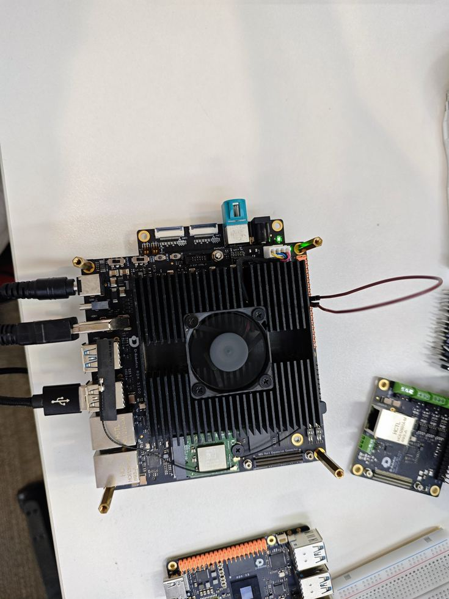

# RDK S100 SPI0 回环

本文根据已录制课程的配套课件整理，保留原课件的接线、命令、实测结果和验证范围。

[原始课件](https://github.com/D-Robotics/rdk-course-demos/blob/develop/01_beginner/13_40pin_spi/lesson-13-s100-zh.html)

两根信号线完成 12 MHz 全双工验证。

## 最少硬件验证 SPI0

S100 作为主机发送两个字节，MOSI 与 MISO 短接后立即回读。

### 一根跳线

Pin 19 MOSI 与 Pin 21 MISO 直接连接。

### 12 MHz

官方示例把总线速率设置为 12000000 Hz。

### 逐字节判定

持续读回 0x55 0xAA 才算通过。

## 四类核心信号

### SCLK

主机产生时钟，决定每一位数据何时采样。

### MOSI

主机输出、从机输入，本课发送测试数据。

### MISO

主机输入、从机输出，本课接收回环数据。

### CS

片选目标外设；回环测试仍通过 spidev0.0 打开 CS0。

## SPI0 的 J24 物理脚

40-pin 数字 IO 为 3.3V，SPI0 只支持主模式。

- Pin 19：MOSI
- Pin 21：MISO
- Pin 23：SCLK
- Pin 24：CS0
- Pin 26：CS1
- 本课只短接 Pin 19 与 Pin 21

## SPI0 回环实拍接线

一根杜邦线连接 MOSI 与 MISO。无需接电源、地线、电阻或额外 SPI 模块。



Pin 19 MOSI ↔ Pin 21 MISO

## 确认 spidev0.0

设备节点把用户态 Python 程序连接到 Linux SPI 控制器。

### 列出节点

```text
ls -l /dev/spidev*
```

本次使用 /dev/spidev0.0。

### 打开控制器

```text
spi.open(0, 0)
spi.max_speed_hz = 12000000
```

bus=0，cs=0。

## 发送数据原路返回

**打开**spidev0.0

**发送**MOSI: 55 AA

**短接**Pin 19 到 Pin 21

**接收**MISO: 55 AA

**比较**完全一致 PASS

## 运行官方 SPI 示例

程序启动后输入 bus 0 和 cs 0，随后每秒传输一组测试字节。

### 执行命令

```text
sudo python3 /app/40pin_samples/test_spi.py
```

按提示输入 0、0。

### 预期输出

```text
0x55 0xAA
0x55 0xAA
STATUS: PASS
```

若得到 0x00 0x00，回环失败。

## SPI0 实测链路

**节点**/dev/spidev0.0

**模式**8-bit transfer

**速率**12,000,000 Hz

**数据**55 AA repeated

**结果**LOOPBACK PASS

## 示例程序的四个动作

### SpiDev

创建 Python SPI 设备对象。

### open

选择 bus 0 与 chip select 0。

### xfer2

发送列表并同步获得接收列表。

### close

退出前关闭句柄，释放设备资源。

## SPI0 通过标准

程序能运行并不等于链路通过，必须检查输出数据。

- /dev/spidev0.0 存在
- Pin 19 与 Pin 21 物理连接可靠
- 总线速率为 12 MHz
- 发送 0x55 0xAA
- 接收持续为 0x55 0xAA
- Ctrl+C 后设备句柄关闭

## 输出异常时这样排查

回环结构简单，问题通常集中在节点、接线或参数。

Node

找不到 spidev0.0 时先确认 SPI0 是否启用。

Wire

读到 0x00 0x00 时断电检查 Pin 19 与 Pin 21。

Select

确认程序选择 bus 0、cs 0，而不是其他控制器。

Access

Permission denied 时使用 sudo，并结束占用设备的旧进程。

## 三种总线的最小验证

### UART

TX 与 RX 短接，检查异步串行收发。

### I2C

扫描带地址的从设备，再读写寄存器。

### SPI

MOSI 与 MISO 短接，同步全双工回环。

## 完成

S100 SPI0 在 12 MHz 下持续回读 0x55 0xAA，最小回环链路验证完成。

### 接线最少

只连接 Pin 19 与 Pin 21。

### 证据清楚

终端持续输出与 PASS 状态已录制。

### 可继续扩展

后续可连接真实 SPI 传感器或显示模块。
