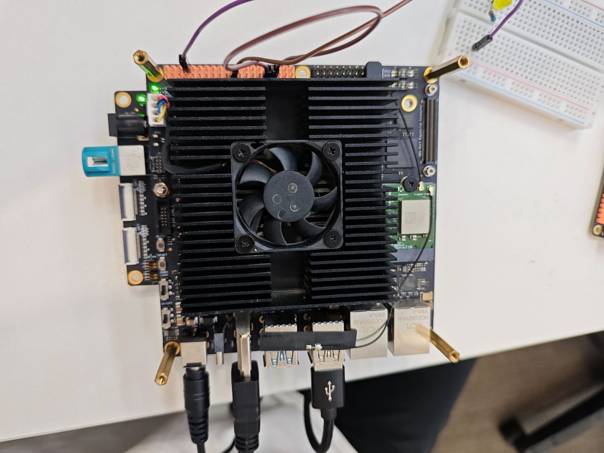
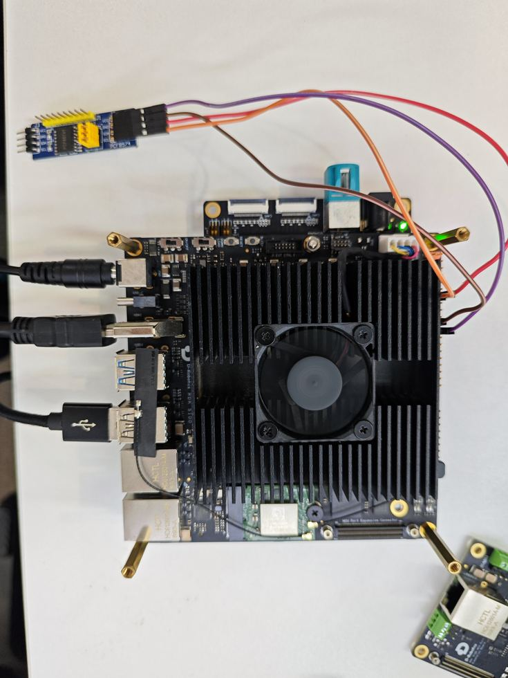

# RDK S100 UART and I2C

This handbook follows the recorded course slides, including wiring, commands, measured results, and the scope of verification.

[Source slides](https://github.com/D-Robotics/rdk-course-demos/blob/develop/01_beginner/12_40pin_uart_i2c/lesson-12-s100.html)

Build two minimal links with loopback and a PCF8574T module.

## Two buses, two evidence types

UART uses transmit-and-receive equality. I2C uses address discovery and data write-back.

### UART2

Short Pins 8 and 10, then receive the same AA55 bytes.

### I2C4

Connect Pins 27 and 28 to PCF8574T and detect address 0x20.

### Minimal setup

No USB-to-TTL adapter, analyzer, or external power supply.

## UART and I2C serve different links

### UART

Point-to-point asynchronous communication over TX and RX.

### I2C

Shared clock and data lines with address-based devices.

### Logic level

Both S100 40-pin interfaces use 3.3 V logic.

### Shared goal

Verify the full path from Linux device node to physical wiring.

## Understand the SW6 selection

I2C5 and UART2 on J24 are selected by the 40 PIN switch. This lesson uses UART2, then keeps it selected while I2C runs on independent I2C4.

- Power off before moving SW6
- UART2 uses physical Pins 8 and 10
- I2C5 uses Pins 3 and 5
- I2C4 uses Pins 27 and 28
- I2C4 remains available while UART2 is selected

## UART2 loopback wiring

Use one jumper to connect Pin 8 TXD directly to Pin 10 RXD. Do not connect power or ground for this loopback.



Pin 8 TXD ↔ Pin 10 RXD

## Enable UART2 in hardware and software

UART2 is disabled by default. The verified setup keeps a recovery backup, enables uart2, and disables multiplexed i2c5.

Step 1

Power off and set the SW6 40 PIN switch to UART2.

Step 2

Set uart2 to okay and i2c5 to disabled in the device tree.

Step 3

Reboot and confirm that /dev/ttyS2 exists.

Step 4

Connect Pins 8 and 10, then start the loopback.

## Send AA55 and verify the return

The measured run uses /dev/ttyS2 at 921600 baud. Transmitted and received bytes match exactly.

### Device node

```text
ls -l /dev/ttyS2
```

Confirm the node before testing.

### Loopback result

```text
TX: AA55
RX: AA55
STATUS: PASS
```

Compare bytes, not only process startup.

## UART loopback evidence

**Open**/dev/ttyS2

**Configure**921600 8N1

**Transmit**AA55

**Receive**AA55

**Accept**Byte match PASS

## I2C4 avoids another SW6 change

I2C4 is available independently on Pins 27 and 28. The S100 provides 3.3 V power to the module.

### Bus

/dev/i2c-4

### Power

Pin 17 supplies 3.3 V and Pin 20 is ground.

### Peripheral

The measured PCF8574T address is 0x20.

## Four-wire PCF8574T connection

VCC, ground, SDA, and SCL are all required. The module uses 3.3 V power and 3.3 V logic.



Pin 17→VCC | Pin 20→GND | Pin 27→SDA | Pin 28→SCL

## Scan the address before reading

A0, A1, and A2 determine the module address, so discovery comes before any hard-coded value.

### Scan the bus

```text
sudo i2cdetect -y 4
```

This run finds 0x20; 0x2F is also present on the board.

### Official sample

```text
sudo python3 /app/40pin_samples/test_i2c.py
```

Choose i2c-4 and enter the detected address.

## I2C read and write evidence

**Enumerate**Find /dev/i2c-4

**Scan**Detect 0x20

**Read**Return 0xFF

**Write back**Send a test value

**Accept**Read/write PASS

## Communication failure checks

Verify pin multiplexing and device nodes before changing the wiring.

UART

If ttyS2 is absent, check SW6, the device tree, and reboot.

Loop

If transmit works but receive is empty, inspect Pins 8 and 10.

I2C

If 0x20 is absent, inspect 3.3 V, ground, SDA, and SCL.

Address

Do not mistake the board device at 0x2F for PCF8574T.

## complete

UART2 loopback and I2C4 peripheral access now have repeatable terminal evidence.

### UART2 PASS

AA55 transmit and receive bytes match.

### I2C4 PASS

0x20 is detected, read, and written back.

### Next lesson

Verify SPI0 full-duplex loopback with one jumper.
