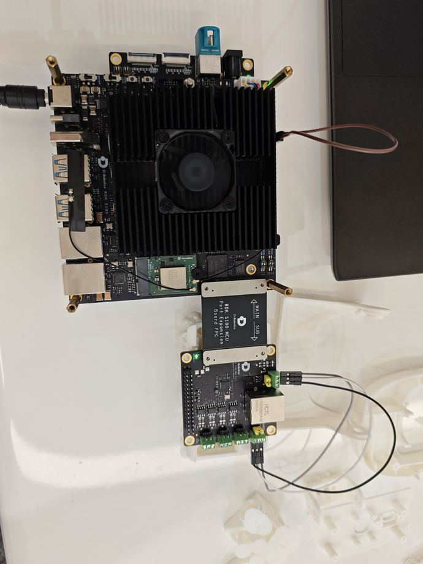

# RDK S100 CAN Communication

This handbook follows the recorded course slides, including wiring, commands, measured results, and the scope of verification.

[Source slides](https://github.com/D-Robotics/rdk-course-demos/blob/develop/01_beginner/14_can/lesson-14-s100.html)

Verify CAN from a robot reset to a physical MCU expansion-board loopback.

## Two CAN paths, two kinds of evidence

Robot reset shows the application. MCU expansion loopback verifies the S100 physical CAN path.

### USB-to-CAN

Run one official reset through the robot SDK.

### MCU-CAN

Connect CAN6 transmit to CAN5 receive on the expansion board.

### Measured Result

All 12 transmissions match in ID and eight-byte payload.

## S100 CAN crosses the MCU expansion path

### Acore

Official CAN HAL samples run in Linux user space.

### MCU1

Firmware forwards IPC channels to CAN.

### Expansion Board

An FPC links the main board and MCU interface board.

### Transceivers

CAN5 and CAN6 expose physical differential buses.

## From robot application to physical bus

**Robot**Pose offset

**USB-to-CAN**Official reset

**MCU1**running / alive

**CAN6→CAN5**Three-wire loop

**12/12**Frame match

## S100 resets the robot

The test reuses the same robot\_py SDK, existing motor configuration, and default pose without recalibration.

### Visible Motion

The waist and multiple joints return from an offset pose.

### Official Sequence

Initialize, read, reset, read again, and deinitialize.

### Clean Exit

deinit returns not initialized and closes four CAN links.

## Keep the two demonstrations distinct

Together they form the lesson evidence, but each uses different hardware.

- Robot reset proves the S100, USB-to-CAN, SDK, and actuator chain can work
- Waist feedback changes by about 43.2 degrees
- One reset is not walking, dancing, or full-joint accuracy acceptance
- The MCU expansion test is not connected to robot motors
- CAN6-to-CAN5 physical loopback proves the expansion-board CAN path

## MCU expansion-board CAN loopback

Connect CAN\_H, CAN\_L, and ground between CAN6 and CAN5, with one 120-ohm termination at each end.



CAN6 H/L/GND → CAN5 H/L/GND | two 120Ω terminations | 1 Mbps

## How one frame crosses the full path

**can\_send**Acore sample

**IPC ch6**bypass 6

**CAN6**Physical TX

**CAN5**Physical RX

**IPC ch4**can\_get output

## Run copies of the official examples

The original slash app slash Can directory remains unchanged; code, configuration, and logs stay in the isolated project.

### Receiver

```text
sudo ./can_get
IPC instance 0 / channel 4
CAN5 RX
```

Start the receiver before transmitting.

### Transmitter

```text
sudo ./can_send bypass 6
CAN6 TX @ 1 Mbps
```

Send an eight-byte classic CAN frame with ID 0x131.

## The terminal shows the physical loopback

One recording displays MCU state, transmitted frames, received frames, and final PASS.

### Transmit

CAN6 sends twelve frames with ID 0x131.

### Receive

CAN5 returns the identical eight-byte payload.

### Judge

Report physical CAN PASS only after all 12 frames match.

## S100 MCU-CAN measured result

### Direction

CAN6 TX → CAN5 RX

### Bitrate

1,000,000 bit/s

### Frame

ID 0x131 / 8 bytes

### Result

12 sent / 12 received / all matched

## The test leaves a reproducible state

The expansion-board work stays in an isolated directory and does not rewrite the frozen project or services.

- MCU1 uses the official S100 4.0.5 S100\_MCU\_DEBUG.elf
- MCU1 reports running and alive during the test
- Official samples are copied into new\_project before building
- No canhal\_get or canhal\_send process remains after testing
- SSH stays enabled; networking and the original project remain unchanged

## Check missing frames in order

Channel mapping, termination, and direction must match the current firmware.

Step 1

Confirm MCU1 is running and alive, then verify the official firmware version.

Step 2

Check CAN\_H to CAN\_H, CAN\_L to CAN\_L, and ground to ground.

Step 3

Use one 120-ohm termination at each end and configure 1 Mbps.

Step 4

The current firmware is verified with CAN6 transmitting and CAN5 receiving.

## RDK S100 CAN verification complete

A robot application and MCU expansion-board loopback demonstrate the S100 CAN development path.

### Visible Application

USB-to-CAN drives an official robot reset.

### Complete Path

Acore, MCU, FPC, transceivers, and wires are exercised.

### Reproducible Result

CAN6 to CAN5 matches 12 of 12 frames.
