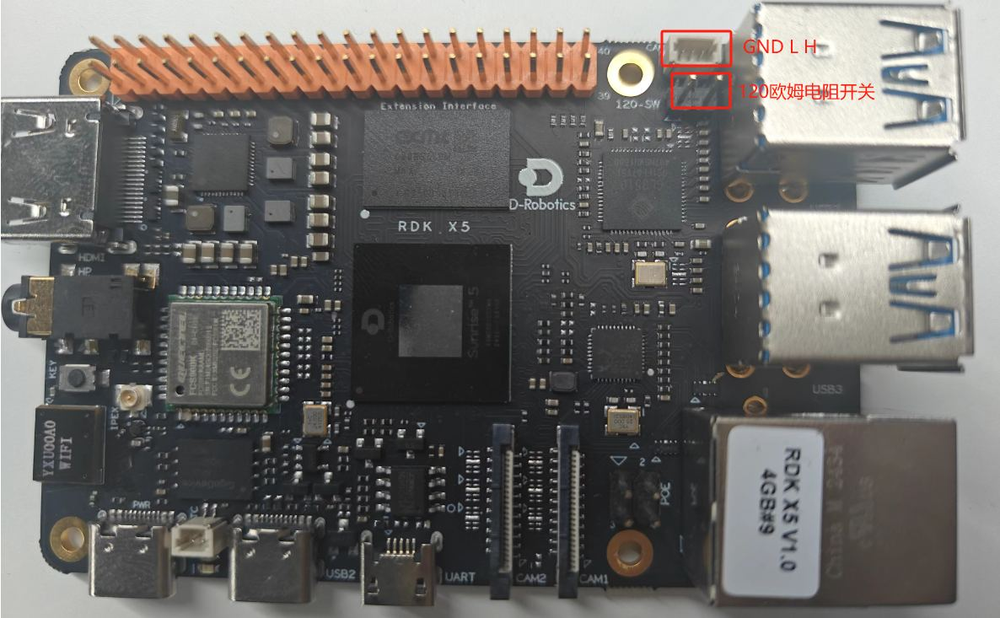

# RDK X5 CAN communication

This handbook follows the recorded course slides, including wiring, commands, measured results, and the scope of verification.

[Source slides](https://github.com/D-Robotics/rdk-course-demos/blob/develop/01_beginner/14_can/lesson-14-x5.html)

Two reproducible layers: a real robot application and an onboard controller loopback.

## Two CAN paths, two kinds of evidence

First observe CAN in a robot application, then verify the X5 onboard controller independently.

### USB-to-CAN

Run one official reset through the already validated robot control path.

### Onboard CAN

Identify can4 and enable the controller's internal loopback mode.

### Closed Evidence

All 100 frames match while controller error counters remain zero.

## CAN supports reliable multi-node control

### Identifier

The frame ID expresses priority and application meaning.

### Differential Bus

External CAN\_H and CAN\_L reject common-mode interference.

### Controller

Linux exposes the controller through SocketCAN.

### Acceptance

Compare ID, length, and payload—not only interface presence.

## Separate application proof from controller proof

**Robot**Calibrated

**USB-to-CAN**Drive actuators

**Reset**Visible motion

**can4**Internal loopback

**100/100**Frame match

## Robot reset shows practical CAN value

After the robot is moved slightly away from its default pose, the official control flow returns the joints toward the reset target through USB-to-CAN.

### Visible Motion

The body and joints perform a continuous controlled reset.

### Reuse the Team Path

Keep the deployed SDK, configuration, and default pose.

### Course Evidence

CAN carries real actuator control, not just terminal text.

## What does the motion prove?

The USB-to-CAN motion and onboard loopback complement each other, but they are not interchangeable.

- The existing robot, USB-to-CAN adapter, and actuator path complete an official reset
- Joint feedback changes before and after motion
- One reset is not a walking or dancing acceptance test
- The robot motion does not use the X5 white SH1.0 connector
- The following can4 loopback verifies the onboard controller separately

## X5 onboard CAN and external connector

can4 is the X5 onboard m\_can controller. This lesson uses controller-internal loopback, so the SH1.0 connector does not need an external node.



can4: real onboard controller | internal loopback needs no cable

## Internal loopback still uses real hardware

**Prepare**can4 DOWN

**Mode**LOOPBACK ON

**Bitrate**1 Mbps

**Frames**ID 0x5A5

**Compare**Sequence + data

## Configure, transfer, and restore

Software echo is disabled so SocketCAN self-echo cannot be mistaken for controller loopback.

### Interface Setup

```text
ip link set can4 type can bitrate 1000000 loopback on
ip link set can4 up
```

Run only when the interface starts DOWN.

### Test Frames

```text
ID: 0x5A5
DATA: sequence + AA551234
COUNT: 100
```

Compare ID, length, and payload for every frame.

## The terminal shows every test stage

The recording identifies can4, displays the loopback setup, counts frames, and ends with PASS.

### Transmit

Generate 100 classic CAN frames with incrementing sequence numbers.

### Receive

Read the same frames back through the physical controller path.

### Judge

Report PASS only after 100 of 100 frames match, then restore state.

## X5 onboard loopback result

### Interface

can4 / m\_can / SPI5.0

### Bitrate

1,000,000 bit/s

### Frame

Standard ID 0x5A5, 8 bytes

### Result

100 sent, 100 received, 100 matched

## Restore a clean state after testing

The test does not configure the robot USB-CAN interfaces can0 through can3 and leaves no background process.

- Close both test sockets
- Return can4 to DOWN
- Turn LOOPBACK and LISTEN-ONLY off
- Confirm berr-counter tx=0 and rx=0
- Do not reload drivers, reboot, or change the device tree

## Check loopback failures in order

Confirm the interface and mode first, then rule out software echo and filtering.

Step 1

Use can4, not the robot USB-to-CAN interfaces can0 through can3.

Step 2

Do not enable listen-only while transmitting.

Step 3

Disable sender-side software echo to avoid duplicate frames.

Step 4

After exit, confirm can4 is DOWN and both modes are OFF.

## RDK X5 CAN verification complete

A real robot reset and an onboard controller loopback demonstrate both application and development capability.

### Visible Application

USB-to-CAN drives an official robot reset.

### Testable Controller

can4 completes a 1 Mbps internal loopback.

### Clear Scope

Internal loopback is not an external harness or motor-protocol test.
