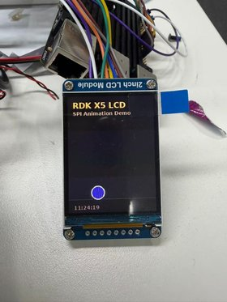

# Lesson 13: RDK X5 SPI display and animation

Connect a two-inch ST7789 color LCD to the RDK X5, display a static test image, then run a bouncing ball animation. This page contains the wiring, setup commands, expected results, and the driver code that explains how a frame reaches the display.

> **Hardware:** RDK X5 + 2.0-inch 240 × 320 ST7789 SPI LCD with VCC/GND/DIN/CLK/CS/DC/RST/BL pins.
>
> **Course code:** [Lesson 13 on the develop branch](https://github.com/D-Robotics/rdk-course-demos/tree/develop/01_beginner/13_40pin_spi).
>
> These pin numbers and defaults are for **X5**. The repository's `README_S100.md` covers a different board. Other display controllers or panel sizes may require different initialization and dimensions.

## What you will build

First, use `rdk_x5_lcd_st7789.py` to display a gradient, color bars, text, and a timestamp. Then use `lcd_animate.py` to draw a bouncing ball, a pulsing title, and a clock that updates.

{ width="280" }

Complete the static image and color checks before starting the animation. This separates basic wiring and initialization problems from refresh-rate issues.

## SPI signals and display control

SPI is synchronous: the controller supplies SCLK to time data transfers. Separate MOSI and MISO lines allow data to travel in both directions. This experiment only writes to the display, so **MISO is not connected**.

| Signal | Role in this lesson |
| --- | --- |
| SCLK / CLK | Clock generated by the X5 |
| MOSI / DIN | Data from the X5 to the display |
| MISO | Data in the other direction; unused in this experiment |
| CS | Chip select; LOW selects the display |
| DC | LOW for a command byte, HIGH for command parameters or pixel data |
| RST | Hardware reset, using a LOW pulse followed by release |
| BL | Backlight control |

SPI uses chip-select lines to select devices, rather than I2C-style device addresses. The driver uses **Mode 0** (`CPOL=0, CPHA=0`), **8 bits per word**, and a default clock of **24 MHz**. DC, RST, and BL use `Hobot.GPIO`; the SPI connection uses `spidev`.

## Hardware and wiring

You need an RDK X5, the specified ST7789 module, and eight suitable jumper wires.

!!! warning "Power off before wiring"
    Shut down the X5 and disconnect power before connecting or changing wires. For this setup, connect VCC to **3.3 V**, not 5 V, and connect a common ground. All numbers below are **BOARD physical pin numbers**, matching `GPIO.setmode(GPIO.BOARD)`.

| LCD pin | RDK X5 physical pin | Function |
| --- | --- | --- |
| VCC | **1** or **17** | 3.3 V power |
| GND | **6** | Ground; 9/14/20/25/30/34/39 are alternatives |
| DIN / MOSI | **19** | SPI1_MOSI |
| CLK / SCLK | **23** | SPI1_SCLK |
| CS | **24** | SPI1_CSN1; corresponds to `/dev/spidev1.1` |
| DC | **22** | GPIO output for command/data selection |
| RST | **31** | GPIO output for reset |
| BL | **33** | GPIO output for backlight |

If BL is wired directly to 3.3 V instead, add `--no-bl` to **both** demo commands. The backlight will stay on independently of the GPIO.

## Enable SPI1

Run the configuration utility:

```bash
sudo srpi-config
```

Open **3 Interface Options → I3 Peripheral bus config**, enable the SPI1 function, and reboot. Menu labels can vary by system version; use the equivalent peripheral bus configuration.

After rebooting, check the device files:

```bash
ls -l /dev/spidev*
ls -l /dev/spidev1.1
```

This lesson specifically requires **`/dev/spidev1.1`**. It maps to `spi.open(1, 1)`: bus 1, chip-select index 1. Seeing some other SPI device file is not enough.

The device file confirms that Linux exposes the interface. It does not confirm that the display is connected or initialized correctly.

## Get the code and check dependencies

For a new checkout:

```bash
git clone --branch develop --single-branch https://github.com/D-Robotics/rdk-course-demos.git
cd rdk-course-demos/01_beginner/13_40pin_spi/code
ls rdk_x5_lcd_st7789.py lcd_animate.py
```

If you already have a checkout, use the Lesson 13 `code` directory from its `develop` branch. Keep both Python files in the same directory: the animation imports the driver.

All remaining demo commands run **from that `code` directory**. Use `sudo python3` for the SPI and GPIO access used here. Check imports with the same interpreter:

```bash
sudo python3 -c "import Hobot.GPIO, spidev; from PIL import Image; print('Dependencies OK')"
```

If `spidev` or Pillow is missing, install the system packages and repeat the import check:

```bash
sudo apt update
sudo apt install python3-spidev python3-pil
```

If `Hobot.GPIO` is missing, restore the GPIO environment provided for your RDK X5 system image before continuing. Installing packages only into a user's virtual environment does not make them available to `sudo python3`.

## Experiment 1: Static display test

With wiring checked and the board powered on, run:

```bash
sudo python3 rdk_x5_lcd_st7789.py --hold
```

The terminal should print:

```text
LCD draw complete.
Holding. Press Ctrl+C to exit.
```

The expected image contains a gradient background, color bars across the top, the text `RDK X5`, `2.0 SPI LCD`, and `ST7789 RGB565`, plus a timestamp near the bottom.

**`--hold` keeps the process alive after drawing once. It does not refresh the image or update the timestamp.** Press `Ctrl+C` to exit before running another test.

### Check red, green, and blue

Run these commands one at a time, exiting each with `Ctrl+C`:

```bash
sudo python3 rdk_x5_lcd_st7789.py --solid red --hold
sudo python3 rdk_x5_lcd_st7789.py --solid green --hold
sudo python3 rdk_x5_lcd_st7789.py --solid blue --hold
```

If red and blue appear swapped, try `--rgb` and repeat the color checks. For example:

```bash
sudo python3 rdk_x5_lcd_st7789.py --solid red --rgb --hold
```

For a backlight connected directly to 3.3 V:

```bash
sudo python3 rdk_x5_lcd_st7789.py --no-bl --hold
```

## Experiment 2: Bouncing ball animation

After the static image and colors are correct, run:

```bash
sudo python3 lcd_animate.py
```

The terminal prints:

```text
Animation running. Press Ctrl+C to stop.
```

The display shows a dark gradient background, a floor line, a colorful bouncing ball with a shadow, a pulsing `RDK X5 LCD` title, and a clock that updates. The program draws frames with Pillow; it does not need external image files. Press `Ctrl+C` to stop.

Use the same display adjustments that worked in the static test. For example, with swapped color order and a permanently powered backlight:

```bash
sudo python3 lcd_animate.py --rgb --no-bl
```

### Frame rate and SPI speed

Run each comparison separately:

```bash
# Lower target frame rate
sudo python3 lcd_animate.py --fps 15

# Lower SPI clock for troubleshooting
sudo python3 lcd_animate.py --speed 12000000

# Optional higher-speed experiment
sudo python3 lcd_animate.py --speed 40000000
```

The default `--fps 30` is a **target**, not a measured or guaranteed refresh rate. At 240 × 320 pixels and two bytes per pixel, each full frame contains **153,600 bytes (150 KiB)**. At the default 24 MHz clock, transmitting those pixel bytes alone takes at least **51.2 ms**, before drawing, conversion, and transfer overhead. Full-frame updates therefore cannot reach 30 fps at that clock.

The loop sleeps only if time remains after processing a frame. Ball motion is updated once per frame rather than using elapsed time, so changing the actual frame rate also changes its apparent speed. Treat 40 MHz as an optional test; lower the speed if you see corrupted images or stripes.

## How the driver sends an image

The runnable files are [the ST7789 driver](https://github.com/D-Robotics/rdk-course-demos/blob/develop/01_beginner/13_40pin_spi/code/rdk_x5_lcd_st7789.py) and [the animation](https://github.com/D-Robotics/rdk-course-demos/blob/develop/01_beginner/13_40pin_spi/code/lcd_animate.py). The following excerpts explain that code; they are not standalone programs.

### Initialization and command/data selection

`init()` performs a hardware reset, sends the initialization sequence, exits sleep, turns the display on, and clears it. `command()` sets DC LOW for the command byte, then HIGH for any parameters. Commands that need settling time can request a delay.

For each frame, `set_window()` uses `0x2A` and `0x2B` to set the column and row ranges, then `0x2C` to begin writing pixels.

### RGB888 to RGB565

Pillow supplies RGB pixels with eight bits per channel. RGB565 uses five bits for red, six for green, and five for blue. The driver packs each pixel into two bytes, high byte first:

```python
def rgb888_to_rgb565(image: Image.Image) -> bytes:
    out = bytearray(image.width * image.height * 2)
    i = 0
    for r, g, b in image.getdata():
        value = ((r & 0xF8) << 8) | ((g & 0xFC) << 3) | (b >> 3)
        out[i] = (value >> 8) & 0xFF
        out[i + 1] = value & 0xFF
        i += 2
    return bytes(out)
```

### Set the window and transfer the frame

The `show()` method belongs to the `ST7789` class:

```python
def show(self, image: Image.Image) -> None:
    if image.size != (self.width, self.height):
        image = image.resize((self.width, self.height), Image.Resampling.LANCZOS)
    payload = rgb888_to_rgb565(image.convert("RGB"))
    self.set_window(0, 0, self.width - 1, self.height - 1)
    GPIO.output(self.dc_pin, GPIO.HIGH)
    for start in range(0, len(payload), 4096):
        self.spi.writebytes2(payload[start : start + 4096])
```

It resizes the image when necessary, converts it to RGB565, sets the full-screen window, and writes chunks of up to 4,096 bytes with DC HIGH.

In `lcd_animate.py`, each iteration updates the ball's position, draws a frame with `make_frame()`, calls `lcd.show(frame)`, and waits only if the target frame interval has time remaining.

## Default parameters

| Setting | Default | Option |
| --- | --- | --- |
| SPI bus / chip select | 1 / 1 | `--bus 1 --device 1` |
| Image dimensions | 240 × 320 | `--width 240 --height 320` |
| DC / RST / BL pins | 22 / 31 / 33 | `--dc 22 --rst 31 --bl 33` |
| SPI clock | 24 MHz | `--speed 24000000` |
| SPI mode / word size | Mode 0 / 8 bits | Set in the driver |
| Rotation | 0° | `--rotation 0` (also 90, 180, 270) |
| X / Y offset | 0 / 0 | `--x-offset 0 --y-offset 0` |
| Color order | BGR flag enabled | `--rgb` clears that flag |
| Animation target | 30 fps | `--fps 30` (animation only) |
| Static image hold | Off | `--hold` (static test only) |

Rotation does **not** automatically swap width and height in this driver. If experimenting with 90° or 270°, check dimensions and offsets against the actual panel and inspect for cropping. Start with the default orientation.

## Troubleshooting

| Symptom | What to check |
| --- | --- |
| No `/dev/spidev1.1` | Enable SPI1 and reboot. Check bus 1, chip-select index 1, and CS on physical Pin 24. |
| Backlight is off | With power disconnected, check VCC, GND, and BL. Default BL is Pin 33; use `--no-bl` if BL is connected to 3.3 V. |
| Backlight is on but no image appears | Check MOSI=19, CLK=23, CS=24, DC=22, RST=31, the device file, and the ST7789 panel type. |
| Red and blue are swapped | Try `--rgb` and repeat the three color tests. |
| Corruption or stripes | Try `--speed 12000000`, then inspect wiring. |
| Cropped or shifted image | Check dimensions, rotation, and X/Y offsets for your panel. |
| `Permission denied` | Use `sudo python3` as in this lesson and check device permissions. |
| Python import fails | Repeat the dependency check with the interpreter used to run the demo. |
| Static timestamp does not change | Expected with `--hold`; run `lcd_animate.py` for continuous updates. |
| Animation misses the requested fps | Account for drawing, conversion, and SPI transfer time; the fps option is a target. |

The system sample `/app/40pin_samples/test_spi.py` is a separate bus test. Read its device settings, required wiring, and verification procedure before using it. It does not replace the ST7789 initialization or the two display experiments above.

## Exercises and resources

1. Fill in the eight wiring connections without looking at the table, then verify them before powering on.
2. Run the three solid-color tests and check the effect of `--rgb`.
3. Compare the animation at different target frame rates and SPI clock speeds.
4. Change `ball_r`, `gravity`, or the title in `make_frame()`, then run the animation again.

- [Lesson 13 code and README](https://github.com/D-Robotics/rdk-course-demos/tree/develop/01_beginner/13_40pin_spi)
- [English and Chinese SPI animation sources and export instructions](https://github.com/D-Robotics/rdk-course-demos/blob/develop/01_beginner/13_40pin_spi/SPI_ANIMATIONS.md)
- [Previous lesson: UART and I2C](../beginner/12-40pin-uart.md)
